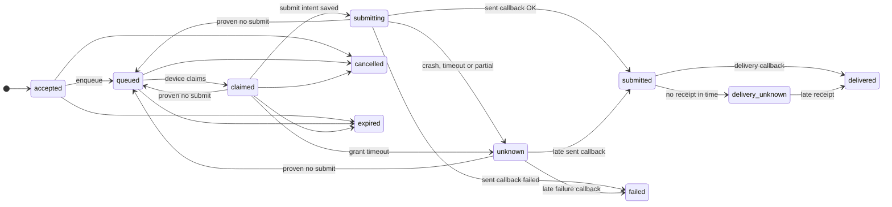

<p align="center"></p>
<h1 align="center">ZROtext</h1>
<p align="center"><strong>Your phone. Your number. Your SMS API.</strong></p>
<p align="center">
  <a href="https://github.com/pboachie/zrotext/actions/workflows/ci.yml"></a>
  <a href="LICENSE"></a>
  <a href="CONTRIBUTING.md"></a>
</p>

ZROtext is an open-source Android SMS gateway. It is designed to connect a dedicated Android phone and its SIM to an API for sending, receiving, and tracking SMS. You can run the gateway yourself; a managed hosting service is planned.

<p align="center"></p>
<p align="center"><sub>Android app design concept · sample data · not a live connection</sub></p>

## Project status

ZROtext is in active development. The repository includes a Rust server, PostgreSQL migrations, a delivery simulator, and an Android app. The local stack is for development. Some phone and billing flows are limited to controlled tests; a hosted SMS service is not available. See the [roadmap](docs/ROADMAP.md) for planned product work.

## How it is designed

- **Bring your own number.** A dedicated Android phone and SIM provide the SMS connection. Carrier charges and carrier rules still apply.
- **Honest delivery states.** The design distinguishes queued, submitted, confirmed, failed, and unknown outcomes rather than treating a network acknowledgment as carrier delivery.
- **Self-hostable source.** The application code, protocol, migrations, and generic deployment examples live in this repository under AGPLv3.
- **Managed option.** Hosted accounts, device monitoring, backups, upgrades, and billing are planned as an operated service built from the public application source.
- **Two-location architecture.** The design supports routing API and device connections across sites while keeping one authoritative database writer and fenced device ownership.

<details>
<summary><b>Delivery state model</b></summary>

Each state change needs evidence from the phone or a timeout. An ambiguous radio submission becomes `unknown` and is never retried automatically, because a retry could send a duplicate SMS. A conflicting callback in any active state also moves the message to `unknown`. See [message semantics](docs/ARCHITECTURE.md#message-semantics-and-the-duplicate-send-problem).



</details>

The architecture describes intended behavior. Check the current code and release notes before relying on a capability.

## Sending responsibly

Only send messages to recipients for whom you have an appropriate basis to send that type of SMS. Keep consent records, honor withdrawal and opt-out requests, and check the rules for your recipients' locations and your carrier or mobile plan. The restricted synthetic pilot now suppresses recognized opt-out replies within its authenticated inbound window and blocks suppressed recipients at acceptance. It still lacks general unsolicited-reply capture and an owner review workflow, so do not use it for general or bulk sending. See [SMS compliance and current limits](docs/SMS-COMPLIANCE.md).

## Roadmap

The [roadmap](docs/ROADMAP.md) covers gateway messaging, self-hosting, account tools, and multi-location support. It shows each capability's stage, what blocks general sending, and where to help. It has no promised release dates.

<!-- roadmap:overview -->
<p align="center"><a href="docs/ROADMAP.md"></a></p>
<!-- /roadmap:overview -->

## Design preview

These interface studies use synthetic devices, messages and traffic. Click an image to inspect it at full size.

| Fleet console concept | Two-location routing concept |
|:---:|:---:|
| <a href="docs/assets/fleet-console-concept.png"></a> | <a href="docs/assets/two-location-concept.png"></a> |

## Run the development stack

Install Docker and Docker Compose, then copy `.env.example` to `.env`. Replace the example password in both `POSTGRES_PASSWORD` and `DATABASE_URL` with the same long random local value. Independently generate 32 random bytes as 64 hexadecimal characters for `RUNTIME_DATABASE_PASSWORD` (for example, `openssl rand -hex 32`). The API uses this restricted runtime role; the migration credential stays separate. See [database role upgrades](deploy/compose/README.md#database-role-separation) for existing volumes.

```sh
cp .env.example .env
docker compose --env-file .env -f deploy/compose/compose.yaml up -d --build
curl http://127.0.0.1:8080/healthz
curl http://127.0.0.1:8080/readyz
```

The stack runs database migrations before the API starts. Dispatch is disabled by default. To run a second local API instance against the same PostgreSQL writer, add `--profile two-hub` before `up`; it listens on `127.0.0.1:8081`. See the [Compose guide](deploy/compose/README.md) for migration and volume details.

To create the first owner, follow the [local bootstrap steps](docs/SELF-HOSTING.md#owner-registration). Later invited owners can register and verify their email at `/owner/account` on the configured HTTPS origin; MFA management is on the same page after sign-in.

## Documentation

- [Architecture and API contracts](docs/ARCHITECTURE.md)
- [Two-location routing and failover design](docs/MULTI-LOCATION.md)
- [Security design](docs/SECURITY-DESIGN.md)
- [SMS compliance and current limits](docs/SMS-COMPLIANCE.md)
- [Roadmap](docs/ROADMAP.md)
- [Self-hosting](docs/SELF-HOSTING.md)
- [Android development and testing](docs/ANDROID-TESTING.md)
- [Android device compatibility](docs/DEVICE-COMPATIBILITY.md)
- [Protocol contracts](protocol/v1/README.md) and [sealed-content drafts](protocol/drafts/README.md)
- [Release and version tags](docs/RELEASING.md)

## Contributing

Issues and discussions are welcome. Read [CONTRIBUTING.md](CONTRIBUTING.md) for the development checks, sign-off requirement, and pull request process. Report vulnerabilities through the private channel in [SECURITY.md](SECURITY.md).

ZROtext is licensed under [AGPL-3.0-only](LICENSE). Contributors retain their copyright under the terms described in [CONTRIBUTING.md](CONTRIBUTING.md).
