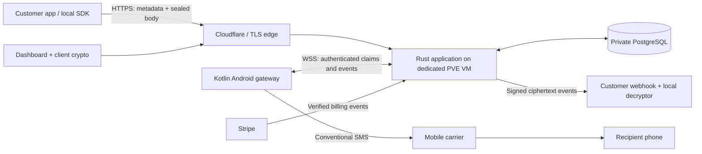

# Architecture and contracts

Proposed design. Start small; the contracts below are acceptance criteria for implementation, not existing endpoints.

**Required extension:** [MULTI-LOCATION.md](MULTI-LOCATION.md) defines two-site API/hub operation, load balancing, database authority and device-session fencing. Its site-aware config, schema and simulator contracts belong in M0/M1; the second physical deployment follows operational readiness. The diagram below shows the initial single-site runtime.

## Runtime



The current foundation uses an Axum/Tokio application binary with `tokio-postgres` for auth, enrollment and delivery transactions, plus a separate locked migration binary. The planned dashboard uses server-rendered templates, vendored HTMX for non-sensitive interactions, SSE metadata updates and structured redacted tracing. Keep API, device hub, dispatcher, and webhook worker as internal modules until load justifies separate processes. Rust stays on the server first; Android uses Kotlin, Compose, Room and the platform telephony APIs. Do not add UniFFI merely to match the old diagram.

Version selection happens at scaffold time: pin a supported stable Rust toolchain, exact build lockfiles, PostgreSQL major, JDK, Android toolchain, and CI actions by immutable SHA. Record library maintenance, licenses, and known advisories. No Redis, S3, NATS or partitioning required for launch. Add them only with measured need: Redis for shared caches/rate limiting, S3 for MMS, partitions after query/storage evidence. Durable quotas and queue ownership always remain authoritative in PostgreSQL.

Source layout:

```text
crates/domain/          # message states, IDs, limits, errors
crates/server/          # API/auth/device hub/worker/billing/dashboard modules
crates/delivery-store/  # PostgreSQL message/attempt/claim transactions
crates/migrator/        # advisory-locked numbered schema migrations
crates/device-sim/      # deterministic fault-injecting test client
protocol/              # versioned JSON schemas, OpenAPI, shared test vectors
android/               # Kotlin app, Room queue, telephony adapter
packages/crypto/       # small browser/TS encryption module, after reviewed spec
packages/sdk-ts/       # permissively licensed API/crypto client
web/                   # Askama templates, static CSS, small TS islands
deploy/compose/        # complete public self-host example
docs/                  # architecture, threat model, runbooks
docs/design/           # public application design specs; marketing source separate
```

Authentication and encryption are separate. Use a maintained auth implementation: password + tuned Argon2id and verified email, secure HttpOnly SameSite cookies, CSRF protection, session revocation, MFA before paid launch. TLS protects authentication; it does not make passwords invisible to the server. Store server auth secrets independently of content keys. Content vault unlock uses a separate randomly generated recovery/unlock secret initially; login reset cannot recover content. OPAQUE is a later ADR, not an unreviewed substitution during a milestone.

## Schema boundaries

Every tenant-owned table includes `account_id`. Use composite foreign keys and repository methods requiring tenant context. PostgreSQL row-level security may be defense in depth only if transaction-scoped identity and connection-pool reset behavior are tested; it cannot replace authorization tests.

| Table | Essential fields / invariants |
|---|---|
| accounts, users, memberships | One owner seat for v1; distinct account/user IDs leave room for teams |
| sessions, recovery_requests | Hashed session tokens, expiry, revoked_at; auth recovery separate from vault |
| api_keys | Public prefix, random 256-bit token verifier, scopes, optional device restriction, expiry, last_used_at |
| devices, device_keys | Owner account, capabilities, current SIM ID, key IDs, enrollment state, revoked_at |
| pairing_requests | One-use hashed secret, 5-minute expiry, short human comparison code, approved key fingerprint |
| messages | UUID, account/device, direction, recipient metadata, envelope bytes/version, expiry, state_version, timestamps |
| message_attempts | Unique attempt ID, claim generation, lease, submitted evidence, per-segment results |
| message_events | Append-only event ID, sequence, observed_at and received_at, bounded evidence |
| dispatch_jobs | Message/attempt ID, next_attempt_at, lease_owner, lease_until, fencing generation |
| idempotency_keys | Unique account/key, canonical request digest, message ID, retained 7 days |
| usage_periods, usage_ledger | Unique period/metric; transactional reservation/refund references; immutable adjustments |
| webhook_endpoints, webhook_deliveries | Encrypted signing secret, stable event ID, attempts, next_attempt_at |
| subscriptions, billing_events | Provider identifiers, current entitlement period, unique Stripe event ID |
| suppression_entries | Account/normalized-recipient, source, timestamp; created from device opt-out signal/user action |
| security_audit_events | Key/device/permission changes, redacted subjects, no content |

Index queue due times and `(account_id, created_at DESC, id)`. Cursor pagination only. Body history and recipient metadata expire together by plan; retain content-free usage totals as needed and document financial-record obligations separately. Default API body limit 32 KiB; one-recipient SMS; payload cannot exceed six radio segments after decryption. Keep ingress limits before expensive crypto/parsing.

## Message semantics and the duplicate-send problem

```text
accepted → queued → claimed → submitting → submitted → delivered
                    │           │              ├── failed
                    │           └── unknown    └── delivery_unknown
                    └── queued (only with evidence no submit began)
accepted/queued → cancelled | expired | failed
inbound: received → stored → webhook_pending → webhook_acked
```

`submitted` requires a successful Android sent callback; it does not mean delivered. If all required segment delivery callbacks succeed, show `delivered`. If the carrier/device provides no delivery receipt, show `delivery_unknown` after the display timeout while preserving the submission fact. Multipart partial submission has an explicit error/result object; do not resend the entire body automatically.

Exactly-once SMS is not attainable by merely combining an outbox and deduplication. A phone can crash between calling `SmsManager` and persisting its result. Before the call, persist a `submitting` intent with a stable attempt ID. After restart, an unresolved intent is `unknown`; query durable callback/provider evidence if available. **Do not automatically retry an ambiguous radio submission or fail it over to another phone.** Manual resend creates a new message and warns that a duplicate is possible.

Protocol: server leases a job; phone durably stores it, acknowledges, obtains/validates an execution grant, records its local submitting intent, and sends. Bind grants to device, attempt, generation, recipient digest, deadline. Reject expired/stale grants, stale keysets, wrong account, replayed events, and unsupported versions. Lease expiry alone cannot revoke an already executing radio operation. Once an execution grant exists, no other phone receives a replacement until reconciliation proves no submission, or an operator explicitly creates a new attempt. A conservative unknown outcome is preferable to a double send.

Use a valid claim transaction such as:

```sql
WITH next_jobs AS (
  SELECT id FROM dispatch_jobs
  WHERE next_attempt_at <= now()
    AND (lease_until IS NULL OR lease_until < now())
    AND execution_grant_issued = false
  ORDER BY next_attempt_at, id
  FOR UPDATE SKIP LOCKED
  LIMIT $1
)
UPDATE dispatch_jobs AS j
SET lease_owner = $2, lease_until = now() + interval '30 seconds',
    generation = generation + 1
FROM next_jobs WHERE j.id = next_jobs.id
RETURNING j.*;
```

The SQL is illustrative: preserve state/tenant constraints in the real transaction and test concurrent claimers. PostgreSQL does not support the old plan's bare `UPDATE ... ORDER BY ... LIMIT ... SKIP LOCKED` syntax. [SELECT locking](https://www.postgresql.org/docs/current/sql-select.html)

Default per-device pacing 5 seconds, one radio operation at a time, configurable upward or to a reviewed lower bound. Fair scheduling across accounts. Maximum 100 queued messages/device initially; reject with `DEVICE_QUEUE_FULL` rather than promise delivery outside the expiry window. Heartbeat target 30 seconds while active; offline indicator after 90 seconds, subject to the Android spike. Reconnect with capped exponential backoff/jitter and pending-event reconciliation. A socket reconnect is not a new send attempt.

## Implemented M1 alpha account and enrollment routes

The server mounts these routes only when `AUTH_ORIGIN`, `AUTH_TOKEN_PEPPER_B64`, and
`ENROLLMENT_TOKEN_PEPPER_B64` are configured. Registration is closed unless a
verification mail transport is configured. Device proof acknowledges the key;
it does not authenticate the M0 heartbeat socket or authorize dispatch.

| Method/path | Current contract |
|---|---|
| POST /v1/auth/register; POST /v1/auth/verify-email; POST /v1/auth/resend-verification | Exact HTTPS Origin; verification code is queued in a durable outbox, never returned by HTTP; resend requires the password and uses a generic response |
| POST /v1/auth/login; POST /v1/auth/logout; GET /v1/auth/session | Owner session with secure host-only cookie; logout requires Origin and CSRF proof |
| POST /v1/auth/api-keys; DELETE /v1/auth/api-keys/{key_id} | Owner session, Origin and CSRF proof; token shown only at creation |
| POST /v1/enrollment/pairings; GET /v1/enrollment/pairings/{pairing_id} | Owner creates or views a five-minute, one-use pairing |
| POST /v1/enrollment/pairings/{pairing_id}/claim; POST /v1/enrollment/pairings/{pairing_id}/prove | Phone claims pairing and proves its P-256 key through bounded challenge bodies |
| POST /v1/enrollment/pairings/{pairing_id}/approve; POST /v1/enrollment/pairings/{pairing_id}/cancel | Owner compares code and fingerprint, then approves or cancels with CSRF proof |
| POST /v1/enrollment/devices/{device_id}/challenge; POST /v1/enrollment/devices/authenticate | One-use device-key proof; no socket credential is issued |
| DELETE /v1/enrollment/devices/{device_id} | Owner revokes a device with CSRF proof |
| GET /v1/device-stream | Native WebSocket challenge-response with the enrolled P-256 key; writer-owned session epoch and heartbeat only, with no message commands |

## Planned API v1 outline

The following routes remain design targets, not current server behavior.

| Method/path | Contract |
|---|---|
| POST /v1/messages | Header `Authorization: Bearer`, required `Idempotency-Key`; returns 202 and message ID |
| GET /v1/messages/{id} | Tenant-bound metadata, envelope, event timeline according to scope |
| GET /v1/messages | Cursor list; metadata filters; no server plaintext search |
| POST /v1/messages/{id}/cancel | 409 once execution grant/submission makes cancellation uncertain |
| GET /v1/devices | Health, SIM, queue, last event, supported capabilities |
| POST /v1/webhooks | Strict HTTPS URL and egress validation; scoped admin action |
| GET /v1/usage | Quotas, reservations, refunds, reset times, clear units |
| POST /v1/billing/checkout | Server chooses price; owner-only; idempotent |
| POST /v1/billing/portal | Returns Stripe-hosted portal session URL; no arbitrary iframe |
| POST /v1/billing/stripe-events | Raw-body signature validation; dedupe; fast durable acknowledgment |
| GET /healthz; GET /readyz | Minimal public liveness; private detailed readiness |

Public sealed send example (shape only; **not valid ciphertext**):

```json
{
  "device_id": "device_01",
  "to": "+12025550123",
  "expires_at": "2026-09-23T19:15:00Z",
  "envelope": {
    "v": 1,
    "suite": "REVIEWED_SUITE_ID",
    "keyset_version": 3,
    "nonce": "BASE64URL",
    "ciphertext": "BASE64URL",
    "wraps": [{"key_id": "device_key_01", "enc": "BASE64URL", "ct": "BASE64URL"}]
  }
}
```

The SDK accepts readable message text in the customer's process and encrypts it locally. Public REST does not silently accept plaintext under the sealed promise. A future plaintext convenience mode would require an explicit separate product decision and separate claims. No account-wide API key on a phone, no API key in URL/query, and no secrets in QR examples or logs.

## Android acceptance surface

User-initiated gateway mode, persistent visible notification with Pause, explicit SMS permissions, optional default-SMS role only if implementing the required messaging UI, pairing approval, SIM selection, local history/queue, foreground/background state and diagnostics. Min SDK proposal 28; target latest required SDK at release. Verify current target/store deadlines then; do not target an obsolete SDK to avoid platform restrictions.

Use P-256 device signing keys in Android Keystore, with capability-tested StrongBox preference and explicit fallback metadata. Content encryption keys are distinct. Android documents a limited StrongBox algorithm set; portable Ed25519 hardware storage cannot be assumed. [Keystore](https://developer.android.com/privacy-and-security/keystore)

M0 must choose a legitimate foreground-service type and distribution model from actual platform rules. `dataSync` is not a perpetual-connection loophole on modern Android. Periodic WorkManager is recovery work, not a real-time heartbeat. APK sideloading does not remove operating-system restrictions. Start with dedicated, plugged-in devices and signed APK releases; treat Play approval as a separate gate. If the no-FCM design cannot meet reliability on the tested matrix, document and decide between a narrower supported deployment or optional wake-only push carrying no content. Never silently add FCM or claim third-party-free transit through a CDN. [Timeouts](https://developer.android.com/develop/background-work/services/fgs/timeout) · [WorkManager](https://developer.android.com/develop/background-work/background-tasks/persistent/getting-started/define-work) · [Play permissions](https://support.google.com/googleplay/android-developer/answer/10208820)

## Webhooks, billing, operations

Webhook stable event ID, creation timestamp, delivery timestamp, attempt ID, ciphertext envelope; HMAC-SHA256 signature over `timestamp + '.' + raw_body`, strict replay tolerance, receiver dedupe. Retry schedule proposal: 1m, 5m, 15m, 1h, 6h, 24h (six retries after initial); endpoint paused after 72 hours of sustained failure, UI/email notice, manual replay within retention. HTTP 2xx is acknowledgment; reject redirects. Bound connect/read timeouts and response bytes. Resolve DNS at connect, validate all chosen IPv4/IPv6 addresses, pin the validated address for the request with correct TLS hostname, block loopback/private/link-local/metadata and rebinding; isolate the worker at network level.

Stripe Checkout and hosted Customer Portal; signed raw-body events, unique event records, reconciliation jobs, and test-mode lifecycle tests. Server-side price allowlist; no client-controlled entitlement flags. [Stripe webhooks](https://docs.stripe.com/webhooks)

Pilot targets, to measure on the proposed 2-vCPU/4-GB VM: 50 accepted requests/sec for 10 minutes with 100 simulated devices; p95 API acknowledgment <250 ms and p95 online dispatch <1 s excluding radio/carrier latency. Distinguish synthetic sockets, actual connected phones, and end-recipient delivery. Do not make the old 1,000-RPS/10,000-socket numbers a v1 release gate.
