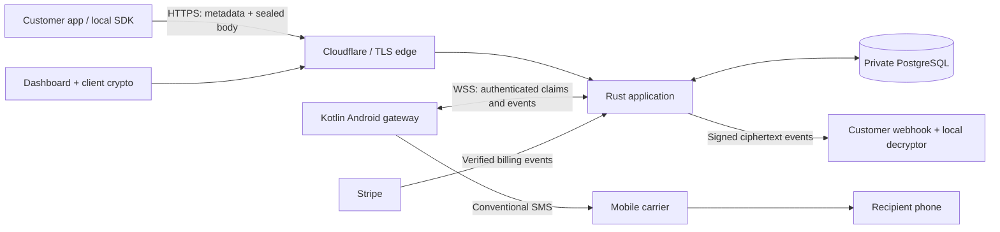

# Architecture and contracts

This document describes the gateway architecture and protocol direction. Sections marked as proposed are design references; check the code and releases for implemented behavior.

[MULTI-LOCATION.md](MULTI-LOCATION.md) defines two-site API/hub operation, load balancing, database authority and device-session fencing. The diagram below shows a single-site runtime.

## Runtime


```mermaid
flowchart LR
  SDK[Customer app / local SDK] -->|HTTPS: metadata + sealed body| EDGE[Cloudflare / TLS edge]
  WEB[Dashboard + client crypto] --> EDGE
  EDGE --> APP[Rust application]
  APP <--> PG[(Private PostgreSQL)]
  PHONE[Kotlin Android gateway] <-->|WSS: authenticated claims and events| APP
  PHONE -->|Conventional SMS| CARRIER[Mobile carrier]
  CARRIER --> RECIPIENT[Recipient phone]
  APP -->|Signed ciphertext events| HOOK[Customer webhook + local decryptor]
  STRIPE[Stripe] -->|Verified billing events| APP
```

The current foundation uses an Axum/Tokio application binary with `tokio-postgres` for auth, enrollment and delivery transactions, plus a separate locked migration binary. The planned dashboard uses server-rendered templates, vendored HTMX for non-sensitive interactions, SSE metadata updates and structured redacted tracing. Keep API, device hub, dispatcher, and webhook worker as internal modules until load justifies separate processes. Rust stays on the server first; Android uses Kotlin, Compose, Room and the platform telephony APIs. Do not add UniFFI merely to match the old diagram.

Toolchain and dependency pins are recorded in [DEPENDENCIES.md](DEPENDENCIES.md). Redis, S3, NATS and partitioning are not required by this design; add them only for a demonstrated need. Durable quotas and queue ownership remain authoritative in PostgreSQL.

Source layout:

```text
crates/domain/          # message states, IDs, limits, errors
crates/server/          # API/auth/device hub/worker/billing/dashboard modules
crates/delivery-store/  # PostgreSQL message/attempt/claim transactions
crates/migrator/        # advisory-locked numbered schema migrations
crates/device-sim/      # deterministic fault-injecting test client
protocol/              # versioned JSON schemas, OpenAPI, shared test vectors
android/               # Kotlin app, Room queue, telephony adapter
packages/crypto/       # small browser/TS encryption module, after reviewed spec
packages/sdk-ts/       # permissively licensed API/crypto client
web/                   # Askama templates, static CSS, small TS islands
deploy/compose/        # complete public self-host example
docs/                  # architecture, threat model, runbooks
docs/design/           # public application design specs; marketing source separate
```

Authentication and encryption are separate. The account design uses password verification, verified email, secure HttpOnly SameSite cookies, CSRF protection, session revocation and MFA. TLS protects authentication; it does not make passwords invisible to the server. Store server auth secrets independently of content keys. Content vault unlock uses a separate randomly generated recovery/unlock secret; login reset cannot recover content. OPAQUE would require a separate protocol decision and migration.

## Schema boundaries

Every tenant-owned table includes `account_id`. Use composite foreign keys and repository methods requiring tenant context. PostgreSQL row-level security may be defense in depth only if transaction-scoped identity and connection-pool reset behavior are tested; it cannot replace authorization tests.

| Table | Essential fields / invariants |
|---|---|
| accounts, users, memberships | One owner seat for v1; distinct account/user IDs leave room for teams |
| sessions, recovery_requests | Hashed session tokens, expiry, revoked_at, coarse last_used_at for the idle timeout; auth recovery separate from vault |
| api_keys | Public prefix, random 256-bit token verifier, scopes, optional device restriction, expiry, last_used_at |
| devices, device_keys | Owner account, capabilities, current SIM ID, key IDs, enrollment state, revoked_at |
| pairing_requests | One-use hashed secret, 5-minute expiry, short human comparison code, approved key fingerprint |
| messages | UUID, account/device, direction, recipient metadata, envelope bytes/version, expiry, state_version, timestamps |
| message_attempts | Unique attempt ID, claim generation, lease, submitted evidence, per-segment results |
| message_events | Event ID, sequence, observed_at and received_at; eligible terminal history pruned after 90 days by default |
| dispatch_jobs | Message/attempt ID, next_attempt_at, lease_owner, lease_until, fencing generation |
| idempotency_keys | Unique account/key, canonical request digest, message ID; expiry enforced on replay and pruned in batches (7 days by default) |
| usage_periods, usage_ledger | Unique period/metric; transactional reservation/refund references; immutable adjustments |
| webhook_endpoints, webhook_deliveries | Encrypted signing secret, stable event ID, attempts, next_attempt_at; terminal delivery history pruned after 30 days by default |
| inbound_events, sealed_inbound_events | Ciphertext or envelope has a 30-day default window; ID, device sequence and digest remain as replay tombstones |
| subscriptions, billing_events | Provider identifiers, current entitlement period, unique Stripe event ID |
| recipient_suppressions (restricted M1 pilot) | Account/E.164 recipient, active state, signed inbound source event and transition timestamp; admission and inbound transitions serialize on the account row; not pruned by retention |
| owner_recipient_holds, owner_opt_out_review_decisions, owner_opt_out_audit | Owner-recorded off-channel holds (E.164, channel and reason codes, report time, release by a signed START observed more than five minutes later; migration 038 guards inserts and release audits), one immutable decision per review item, and an append-only audit; written under the admission account lock; no notes or content; not pruned by retention |
| security_audit_events | Key/device/permission changes, redacted subjects, no content |

The durable outbound metering core uses an operator or billing-provisioned
`usage_quota_policies` row per account. `accept_metered` reserves one unit in
the same transaction as idempotency, message and job insertion. The period is
the UTC calendar month at PostgreSQL transaction start; its limit is copied
from policy when that month's row is first created. Stripe TEST reconciliation
may later rewrite the current period's limit and records the change in
`billing_quota_audit`. Replays of the same request
reuse the original reservation even across a month boundary. Pre-grant cancel
or expiry writes one refund entry against the original period in the same
transaction. An issued grant or ambiguous radio state does not refund. Policy
changes outside that reconciliation path need an explicit, audited adjustment.
The allowlisted synthetic `POST /v1/alpha/messages` route uses metered
acceptance when Stripe TEST billing is enabled and unmetered acceptance
otherwise; it is not a general customer send route. For a bound billing
account, pending reconciliation or a missing test quota returns 503
`billing_pending` with `Retry-After: 10`; queued or held payment risk returns
402 `payment_hold`; an exhausted quota or expired payment grace returns 429
`quota_exceeded` with `Retry-After: 60`. Storage or dispatch failures retain
503 `unavailable`. An identical idempotent replay reuses the original result
without reserving another unit.

The dormant candidate-02 outbound admission function composes current pinned
manifest verification, API authorization, active sealed line binding, request
budget, queue limits and billing reservation in one owned READ COMMITTED
transaction. It locks authority before billing and account rows, and rechecks
current credentials, line generation, writer state and wall-clock freshness
after queue writes. It accepts offline queueing without inventing a device
session. The account/message ID and verified unsigned envelope digest form the
persistent retry identity: a matching retry spends request-budget attempts but
never inserts another job, replaces ciphertext or reserves another unit. Current
authority, expiry and opt-out checks still apply to retries, including after
retention has redacted content. An owner hold or signed suppression blocks
admission under the existing shared account lock.

These records use `sealed_candidate02` transport and carry immutable manifest,
signer and line-generation metadata. Migration 045 restricts them to queued,
cancelled or expired states, and rejects alpha attempts and dispatch fences.
Every existing alpha claim and grant path also excludes this transport. Existing
pre-grant cancellation, expiry refunds and terminal-content retention apply;
retained digests and identity prevent rehydration. No HTTP route or device
service calls this function. Queue acceptance does not authorize decryption,
a sealed grant, a radio effect or delivery. A reviewed grant protocol, runtime
integration, independently provisioned owner authority and device freshness
remain prerequisites; this storage slice does not complete the sealed-send API.

Index queue due times and `(account_id, created_at DESC, id)`. Cursor pagination only. The retention worker redacts terminal message recipients and synthetic payloads after 30 days by default, counted from the last state update. It preserves recipient and request digests, message identity, state and attempts. It removes eligible message events after 90 days and only after their parent content is redacted, terminal webhook delivery/attempt/replay history after 30 days, and inbound ciphertext after 30 days once related webhook history is gone. M1 inbound event IDs, device sequences, digests and signatures remain as replay tombstones. Sealed inbound envelopes are redacted after 30 days while ID, device sequence and unsigned digest remain. Unknown messages and unresolved grant/submission fences defer related content and history; completed submitted/failed fence records do not. Late radio receipts for redacted messages are stale and must be quarantined by the device protocol. New M1 inbound events for a redacted message are rejected as unknown sources; exact replays of stored events are still acknowledged. See [self-hosting retention settings](SELF-HOSTING.md#data-retention). Default API body limit 32 KiB; one-recipient SMS; payload cannot exceed six radio segments after decryption. Keep ingress limits before expensive crypto/parsing.

## Message semantics and the duplicate-send problem

```text
accepted → queued → claimed → submitting → submitted → delivered
                    │           │              ├── failed
                    │           └── unknown    └── delivery_unknown
                    └── queued (only with evidence no submit began)
accepted/queued → cancelled | expired | failed
inbound: received → stored → webhook_pending → webhook_acked
```

`submitted` requires a successful Android sent callback; it does not mean delivered. If all required segment delivery callbacks succeed, show `delivered`. If the carrier/device provides no delivery receipt, show `delivery_unknown` after the display timeout while preserving the submission fact. Multipart partial submission has an explicit error/result object; do not resend the entire body automatically.

Exactly-once SMS is not attainable by merely combining an outbox and deduplication. A phone can crash between calling `SmsManager` and persisting its result. Before the call, persist a `submitting` intent with a stable attempt ID. After restart, an unresolved intent is `unknown`; query durable callback/provider evidence if available. **Do not automatically retry an ambiguous radio submission or fail it over to another phone.** Manual resend creates a new message and warns that a duplicate is possible.

Protocol: server leases a job; phone durably stores it, acknowledges, obtains/validates an execution grant, records its local submitting intent, and sends. Bind grants to device, attempt, generation, recipient digest, deadline. Reject expired/stale grants, stale keysets, wrong account, replayed events, and unsupported versions. Lease expiry alone cannot revoke an already executing radio operation. Once an execution grant exists, no other phone receives a replacement until reconciliation proves no submission, or an operator explicitly creates a new attempt. A conservative unknown outcome is preferable to a double send.

Use a valid claim transaction such as:

```sql
WITH next_jobs AS (
  SELECT id FROM dispatch_jobs
  WHERE next_attempt_at <= now()
    AND (lease_until IS NULL OR lease_until < now())
    AND execution_grant_issued = false
  ORDER BY next_attempt_at, id
  FOR UPDATE SKIP LOCKED
  LIMIT $1
)
UPDATE dispatch_jobs AS j
SET lease_owner = $2, lease_until = now() + interval '30 seconds',
    generation = generation + 1
FROM next_jobs WHERE j.id = next_jobs.id
RETURNING j.*;
```

The SQL is illustrative: preserve state/tenant constraints in the real transaction and test concurrent claimers. PostgreSQL does not support the old plan's bare `UPDATE ... ORDER BY ... LIMIT ... SKIP LOCKED` syntax. [SELECT locking](https://www.postgresql.org/docs/current/sql-select.html)

Dispatch must pace each device, allow one radio operation at a time, and bound each account's and device's live queue. An overfull queue rejects new work with retry guidance. The device stream uses periodic heartbeats and reconnects with bounded backoff and event reconciliation. A socket reconnect is not a new send attempt. Current limits are defined in server code and migrations.

## Account and device routes

The server mounts these routes only when `AUTH_ORIGIN`, `AUTH_TOKEN_PEPPER_B64`, and
`ENROLLMENT_TOKEN_PEPPER_B64` are configured. New account registration also
requires a verification mail transport and explicit allowlist or open
registration mode; it is closed by default. The first verified owner is
created by a local operator CLI on an empty database. Allowlist mode also
requires an address-bound token derived from a private operator key. Closing
registration does not disable existing owner login. Device proof establishes an enrolled
identity for the authenticated device stream.

Membership storage permits one immutable owner and additional observer rows per
account, while retaining one account per user. This is an authorization
prerequisite: observer invitation, sign-in and dashboard routes are not enabled.
All current authentication, API-key admission, enrollment and owner account
operations explicitly require the owner role. Observer rows cannot be promoted,
moved between accounts or restored after revocation. Owner registration/pruning
does not reclaim observer identities, and export selects the owner's profile
even when an account has additional memberships. Observer self-service requires
separate member authorization and per-user MFA storage before it can be enabled.

| Method/path | Current contract |
|---|---|
| POST /v1/auth/register; POST /v1/auth/verify-email; POST /v1/auth/resend-verification | Exact HTTPS Origin; registration policy admits new accounts and otherwise returns a generic acceptance without mail; verification code is queued in a durable outbox, never returned by HTTP; verification and resend require the registrant's password and use generic responses; a registration that collides with a pending sign-up cancels that sign-up's outstanding code and queued mail; an unverified sign-up expires 24 hours after registration and a later registration replaces it |
| POST /v1/auth/login; POST /v1/auth/logout; GET /v1/auth/session | Owner session with secure host-only cookie; logout requires Origin and CSRF proof |
| POST /v1/auth/api-keys; DELETE /v1/auth/api-keys/{key_id} | Owner session, Origin and CSRF proof; token shown only at creation |
| POST /v1/enrollment/pairings; GET /v1/enrollment/pairings/{pairing_id} | Owner creates or views a five-minute, one-use pairing |
| POST /v1/enrollment/pairings/{pairing_id}/claim; POST /v1/enrollment/pairings/{pairing_id}/prove | Phone claims pairing and proves its P-256 key through bounded challenge bodies |
| POST /v1/enrollment/pairings/{pairing_id}/approve; POST /v1/enrollment/pairings/{pairing_id}/cancel | Owner compares code and fingerprint, then approves or cancels with CSRF proof |
| POST /v1/enrollment/devices/{device_id}/challenge; POST /v1/enrollment/devices/authenticate | One-use device-key proof; no socket credential is issued |
| DELETE /v1/enrollment/devices/{device_id} | Owner revokes a device with CSRF proof |
| GET /v1/enrollment/devices?before={device_id} | Owner-only cursor page of enrolled device UUIDs, names, revocation status, and `active_socket_lease`; tenant scoped and no-store |
| GET /owner/events | Owner-only same-origin server-sent-events stream for the dashboard. Requires the session cookie like the snapshot endpoints (no CSRF proof; read-only). Every two seconds it re-authenticates the session and compares a tenant-scoped fingerprint of the same bounded first pages the snapshots render (the first device page, with queue counts capped at 1,000 as in the device list, and the first message timeline page), so each poll does bounded, index-backed work however large the tenant is; a change emits one `changed` event naming the affected sections (`devices`, `messages`). Streams are admitted per process: one open stream per session (a second is refused with 409), at most three per account (429) and at most 32 per server process (503); refusals carry `Retry-After: 60` and `no-store`, and the dashboard keeps its snapshot refresh. A stream releases its slot when it ends for any reason, including a client disconnect, which the server notices when its next per-poll frame fails to write. Comment keepalives run every 15 seconds and each stream ends cleanly after ten minutes or as soon as the session, database, or pool admission fails. The stream signals that a snapshot changed; it never carries message content, phone numbers, or per-device detail, and the snapshot endpoints stay authoritative. |
| GET /owner/devices | Same-origin owner sign-in and enrollment page; manual code and fingerprint comparison, CSRF-protected writes, no pairing token in a URL |
| GET /v1/device-stream | Native WebSocket challenge-response with the enrolled P-256 key and writer-owned session epoch. An opt-in controlled-test extension requires a one-shot phone readiness frame and an allowlisted recipient digest. |
| POST /v1/alpha/messages; GET /v1/alpha/messages/{id}; POST /v1/alpha/messages/{id}/cancel | Mounted only with explicit synthetic-alpha account and recipient allowlists. Bearer API key, tenant/device scope and idempotency are required. The server builds a fixed test body from a short case ID; no caller-supplied arbitrary plaintext or recipient appears in the response. The server assigns the returned `message_id`, derived from the authenticated account and the caller's `client_message_id`; status and cancellation use that `message_id`. A `client_message_id` names one message only within its account, so another account reusing it, or submitting a known message ID, is accepted as unrelated work and never confirms that another account's message exists. Authenticated acceptance attempts are limited to 60 per account and 600 globally per 60 seconds across API keys, devices and API sites. Valid retries also spend attempts; cancellation does not refund them. Exhaustion returns 429 with Retry-After: 60, while budget storage failure returns 503 before message storage. Status and cancellation remain available. This is separate from the planned sealed-content API. |

`active_socket_lease` is an observation of the authoritative writer's current
authenticated device session. It is true only while the lease is unexpired,
the session deployment epoch is current, the hosting site is enabled and not
draining, and the device, key, and account remain active. Reconnection replaces
the device's prior session with a higher connection epoch. A dropped socket can
remain represented until its 90-second lease expires. The owner dashboard holds one
same-origin `GET /owner/events` stream per visible, signed-in tab and refreshes
the device and message lists within a few seconds of a server-side change,
while the same pause rules apply: automatic refresh can be turned off, browsing
older entries, focusing a list row, or opening message events pauses that list
until the owner returns to the latest entries with Refresh or finishes the
interaction. Hidden tabs and page navigation close the stream; returning
reopens it. Because a session may hold only one stream, a second tab signed in
with the same browser session is refused and uses the snapshot refresh below
until the first tab's stream closes. If the stream cannot connect, is refused,
or drops, the dashboard falls back to
refreshing device leases and recent message states every 15 seconds after the
previous refresh finishes, and retries the stream with backoff capped at one
attempt per minute; the backoff restarts only after a stream has stayed
connected for at least 30 seconds, so a connect-drop loop cannot spin. A
failed automatic refresh retains the previous rows with a visible error, and
session expiry closes the stream, clears owner data and stops polling. These
periodic observations are not a continuous connection monitor, and the event
stream is a change signal over the same stored state, not a second data
source.
Approval/revocation and this lease are
separate fields. Neither field establishes Android SMS permission, SIM state,
carrier service, or radio send readiness. The owner API returns 503 rather than
rendering a standby's potentially stale lease state.

Each owner device response also includes `pending_messages` (accepted, queued or
claimed), `in_flight_messages` (submitting or submitted), and the database
`status_observed_at_ms`. Each count is capped at 1,000 and rendered as `1,000+`
at the cap. The query first materializes at most 51 tenant-owned devices for the
50-device page and its next cursor, then runs capped probes ordered by state and creation time to match the existing
`messages_device_state` index. It excludes terminal and uncertain states; these
remain in the message timeline. Counts describe stored writer states, including
work waiting for expiry reconciliation, rather than permission to dispatch.
Offline and revoked devices can still have recorded work. The dashboard shows
the snapshot time, keeps unavailable counts distinct from zero, and marks a
retained snapshot stale when an automatic refresh fails. No SIM identifiers,
phone numbers, message content, or new readiness claim are exposed.

The optional [Android preconditions extension](../protocol/v1/device-preconditions.md)
adds only selected-SIM availability, SMS permission and airplane-mode enums to
the device list. Reports are authenticated-session scoped, timestamped by the
writer and explicitly distinguished as fresh at snapshot time, stale,
disconnected or unavailable. No report authorizes a send or establishes carrier
readiness. Migration 041 stores one latest snapshot with deletion cascades;
reports older than one day are eligible for bounded retention pruning.

## Planned API v1 outline

The following routes remain design targets, not current server behavior.

| Method/path | Contract |
|---|---|
| POST /v1/messages | Header `Authorization: Bearer`, required `Idempotency-Key`; returns 202 and message ID |
| GET /v1/messages/{id} | Tenant-bound metadata, envelope, event timeline according to scope |
| GET /v1/messages | Cursor list; metadata filters; no server plaintext search |
| POST /v1/messages/{id}/cancel | 409 once execution grant/submission makes cancellation uncertain |
| GET /v1/devices | Health, SIM, queue, last event, supported capabilities |
| POST /v1/webhooks | Strict HTTPS URL and egress validation; scoped admin action |
| GET /v1/usage | Quotas, reservations, refunds, reset times, clear units |
| POST /v1/billing/checkout | Server chooses price; owner-only; returns the one open session per account |
| POST /v1/billing/portal | Returns Stripe-hosted portal session URL; no arbitrary iframe |
| POST /v1/billing/stripe-events | Raw-body signature validation; dedupe; fast durable acknowledgment |
| GET /healthz; GET /readyz | Minimal public liveness; private detailed readiness |

Public sealed send example (shape only; **not valid ciphertext**):

```json
{
  "device_id": "device_01",
  "to": "+12025550123",
  "expires_at": "2026-09-23T19:15:00Z",
  "envelope": {
    "v": 1,
    "suite": "REVIEWED_SUITE_ID",
    "keyset_version": 3,
    "nonce": "BASE64URL",
    "ciphertext": "BASE64URL",
    "wraps": [{"key_id": "device_key_01", "enc": "BASE64URL", "ct": "BASE64URL"}]
  }
}
```

The SDK accepts readable message text in the customer's process and encrypts it locally. Public REST does not silently accept plaintext under the sealed promise. A future plaintext convenience mode would require an explicit separate product decision and separate claims. No account-wide API key on a phone, no API key in URL/query, and no secrets in QR examples or logs.

Owner browser pages require JavaScript for sign-in. The credential forms use POST as a defensive native fallback; the JSON-only auth endpoints reject form-encoded submissions without creating a session. The device and billing dashboards deny framing. Billing refresh removes the previous snapshot immediately, and an older response cannot restore account data after a newer refresh has failed.

## Android acceptance surface

User-initiated gateway mode, persistent visible notification with Pause, explicit SMS permissions, optional default-SMS role only if implementing the required messaging UI, pairing approval, SIM selection, local history/queue, foreground/background state and diagnostics. The current Android SDK levels are pinned in [the app build](../android/app/build.gradle.kts).

Use P-256 device signing keys in Android Keystore, with capability-tested StrongBox preference and explicit fallback metadata. Content encryption keys are distinct. Android documents a limited StrongBox algorithm set; portable Ed25519 hardware storage cannot be assumed. [Keystore](https://developer.android.com/privacy-and-security/keystore)

Android background execution depends on platform and device policy. `dataSync` is not a perpetual-connection loophole on modern Android. Periodic WorkManager is recovery work, not a real-time heartbeat. APK sideloading does not remove operating-system restrictions. The gateway targets dedicated devices; any wake-only push option would carry no message content. [Timeouts](https://developer.android.com/develop/background-work/services/fgs/timeout) · [WorkManager](https://developer.android.com/develop/background-work/background-tasks/persistent/getting-started/define-work) · [Play permissions](https://support.google.com/googleplay/android-developer/answer/10208820)

## Webhooks, billing, operations

Webhook stable event ID, creation timestamp, delivery timestamp, attempt ID, ciphertext envelope; HMAC-SHA256 signature over `timestamp + '.' + raw_body`, strict replay tolerance, receiver dedupe. Retry schedule: 1m, 5m, 15m, 1h, 6h, 24h (six retries after initial). The sender pauses an endpoint after 72 hours of sustained transport failure; owner API state shows the pause, and re-enabling resumes pending deliveries. Manual replay is bounded by the endpoint contract. HTTP 2xx is acknowledgment; reject redirects. Bound connect/read timeouts and response bytes. Resolve DNS at connect, validate all chosen IPv4/IPv6 addresses, pin the validated address for the request with correct TLS hostname, block loopback/private/link-local/metadata and rebinding; isolate the worker at network level.

Stripe Checkout and hosted Customer Portal; signed raw-body events, unique event records, reconciliation jobs, and test-mode lifecycle tests. Server-side price allowlist; no client-controlled entitlement flags. [Stripe webhooks](https://docs.stripe.com/webhooks)

The event inbox acts on `checkout.session.completed` (subscription mode), `customer.subscription.*`, `invoice.paid`, `invoice.payment_failed`, and the refund/dispute types `charge.refunded`, `refund.created` and `charge.dispute.created`. Risk holds cover both card charges (`ch_`) and PaymentIntent-scoped non-card charges (`py_`, used by SEPA Direct Debit, ACH and Bacs). A `refund.created` event with a null Charge pointer can instead queue its PaymentIntent pointer for a bounded Charges Read before attribution. A signed test-mode event with an unexpected recognized shape is stored as `unsupported`; a risk type also creates a `needs_review` risk row before 2xx acknowledgment, blocking metered admission when its customer is bound. Invalid signatures, invalid envelopes, live-mode events, and reused event IDs with different bytes can receive 4xx responses. No raw webhook payload is written to logs or the event table.

Performance measurements should distinguish synthetic sockets, actual connected phones, and end-recipient delivery. API acknowledgment and online dispatch exclude radio and carrier latency.
