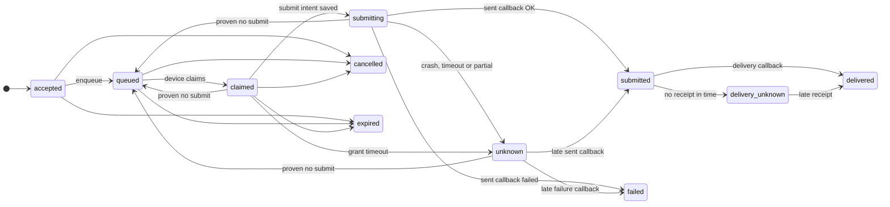

# Delivery state model

Each state change needs evidence from the phone or a timeout. An ambiguous radio submission becomes `unknown` and is never retried automatically, because a retry could send a duplicate SMS. A conflicting callback in any active state also moves the message to `unknown`. See [message semantics](ARCHITECTURE.md#message-semantics-and-the-duplicate-send-problem).

