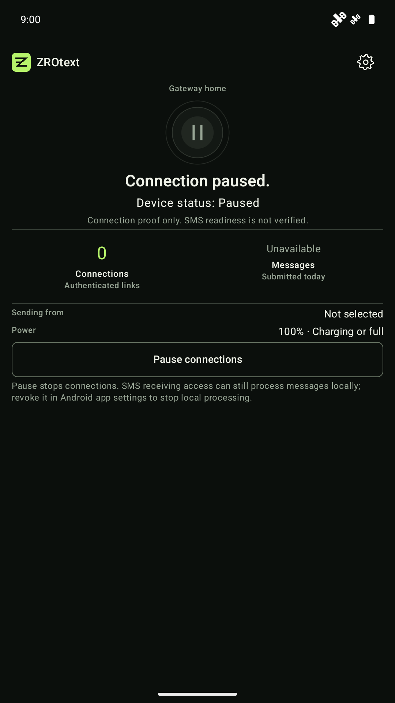
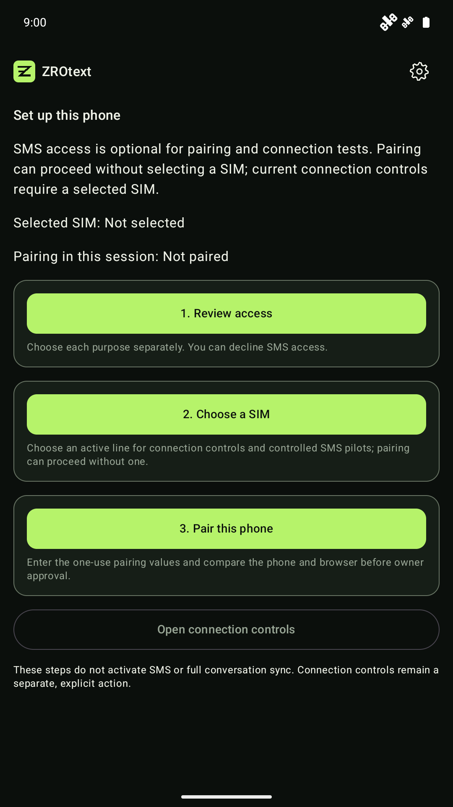
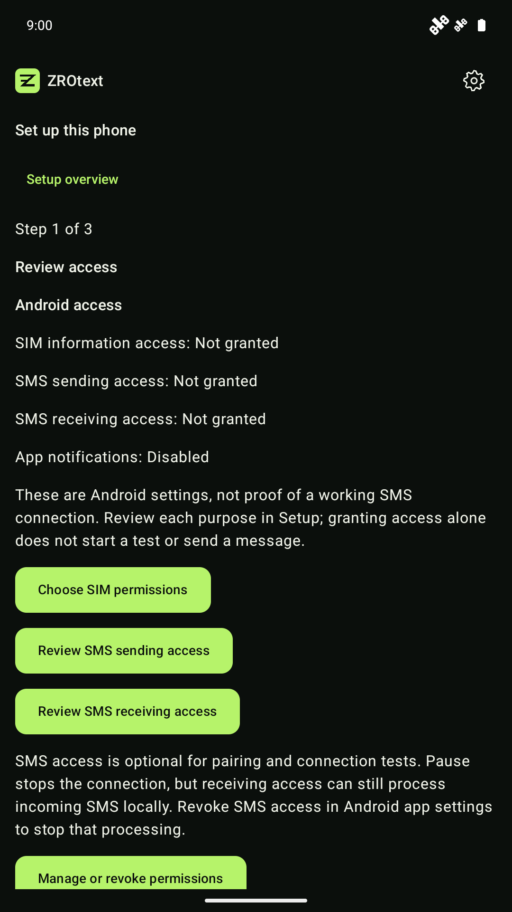
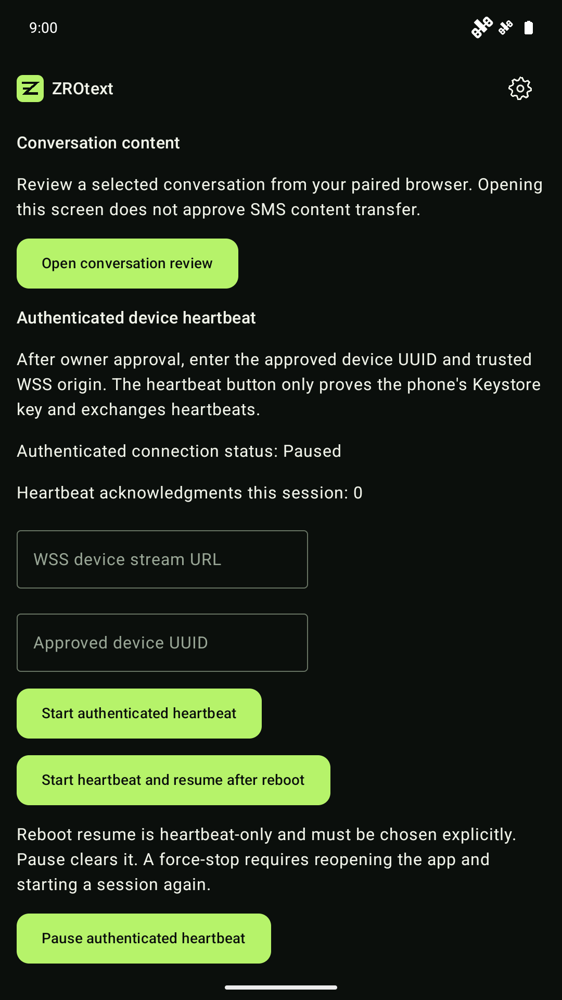
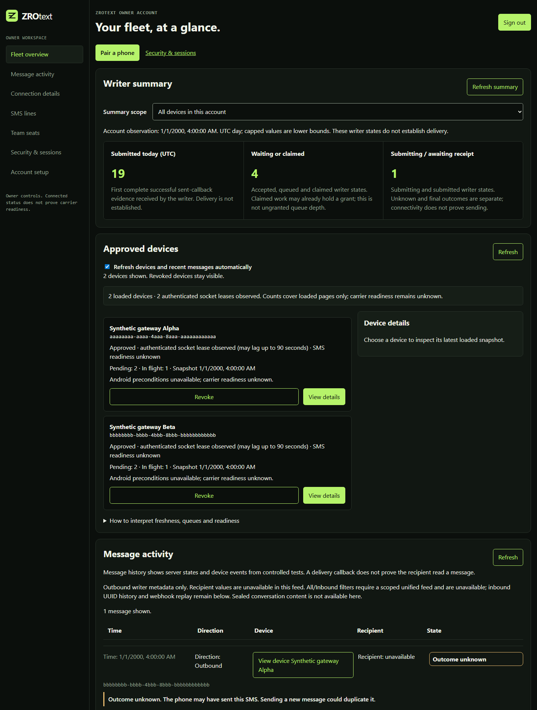

# Current interfaces and setup boundaries

These are captures of maintained application UI, rather than interface concepts. The Android captures show a fresh API 36 emulator running an unmodified debug build of source `09ca8e9f67f1a22ea60f85dd73951ec937792a2c`, at 1080 by 1920 pixels and 320 dpi. No account, pairing, SIM, SMS permission, live connection or message activity was configured. Status-bar demo mode hides unrelated emulator notifications and normalizes the clock; application pixels are unchanged.

The browser capture renders maintained owner HTML/CSS/JavaScript with synthetic responses from the existing browser overview test. Its counts and device leases are fixture values, not operational evidence.

The published [v0.1.6 release](https://github.com/pboachie/zrotext/releases/tag/v0.1.6) comes from `e54a306ef601db7f9b0c5bf291cf084060f0a8fd`, with Android version code 10. The Android source tree is unchanged between that release commit and the capture commit. These debug-source captures do not replace the release's acceptance receipts or prove that its onboarding succeeds. The release remains a restricted pilot. A tested mobile custody slice and normal onboarding integration are separate milestones.

## Android companion

Home leads with observed connection state. Tap Connections or Messages for details; use the gear menu for Setup, Connection and Tools. Unavailable message counts remain unavailable until a separately authorized summary reader is connected.

| Home | Setup |
|:---:|:---:|
|  |  |

| Access choices | Connection controls |
|:---:|:---:|
|  |  |

SMS access is optional for pairing and connection tests. Each purpose has its own disclosure and consent. Setup does not itself activate SMS or conversation sync. Connection controls remain explicit controlled-test actions. Pause stops connections; permission-enabled local SMS processing can continue until receiving access is revoked in Android settings.

Sealed conversations require authenticated identity, line binding, matching root/generation, supported custody, enrollment and separately approved reply authority. Components and emulator fixtures exist; complete normal onboarding and positive physical hardware acceptance remain work in progress. Do not use a paused or synthetic screenshot as proof of SMS delivery or production custody.

## Owner dashboard

The fleet overview separates writer totals, approved devices and message activity. A submitted state does not establish delivery; a socket lease does not establish carrier readiness. Unknown outcomes remain labelled because retrying can duplicate a message. The synthetic browser fixture does not connect to a server, send SMS, exercise account setup or validate a carrier.

Start with [self-hosting](SELF-HOSTING.md) for a development stack, [Android testing](ANDROID-TESTING.md) for build/device checks, and [architecture](ARCHITECTURE.md) for authority and delivery-state boundaries. The README's fleet/two-location concept images and [receptionist simulation](RECEPTIONIST-DEMO.md) remain design references and scripted demonstrations.

## Reproducing and maintaining captures

From `android`, build the selected commit with `gradlew.bat :app:assembleDebug --no-daemon` on Windows (`./gradlew` elsewhere). Install on a disposable emulator with no personal data. Capture Home and navigate through Setup and Connection without entering credentials or enabling a send. Keep missing-permission and unavailable states truthful. Do not substitute a mock interface for application screenshots.

For the owner UI, install pinned dependencies in `web/owner` and run `ZT_OWNER_SCREENSHOTS=1 node --test web/owner/browser/overview.test.js` from the repository root. On PowerShell, set `$env:ZT_OWNER_SCREENSHOTS='1'` first. The test writes full-page captures to a temporary directory; a viewport capture may use the same synthetic route fixture without changing app markup. Use synthetic devices and account metadata only. Review every pixel for credentials, personal information, message content and misleading capability claims before publishing.

Keep raw captures, logs and session notes outside the public tree. Published documentation images need accessible descriptions and a clear source/fixture boundary. Refresh them when the UI changes; preserve concept labels on design images. Store listing graphics are maintained separately from this public source repository and must match the artifact selected by the release owner.
