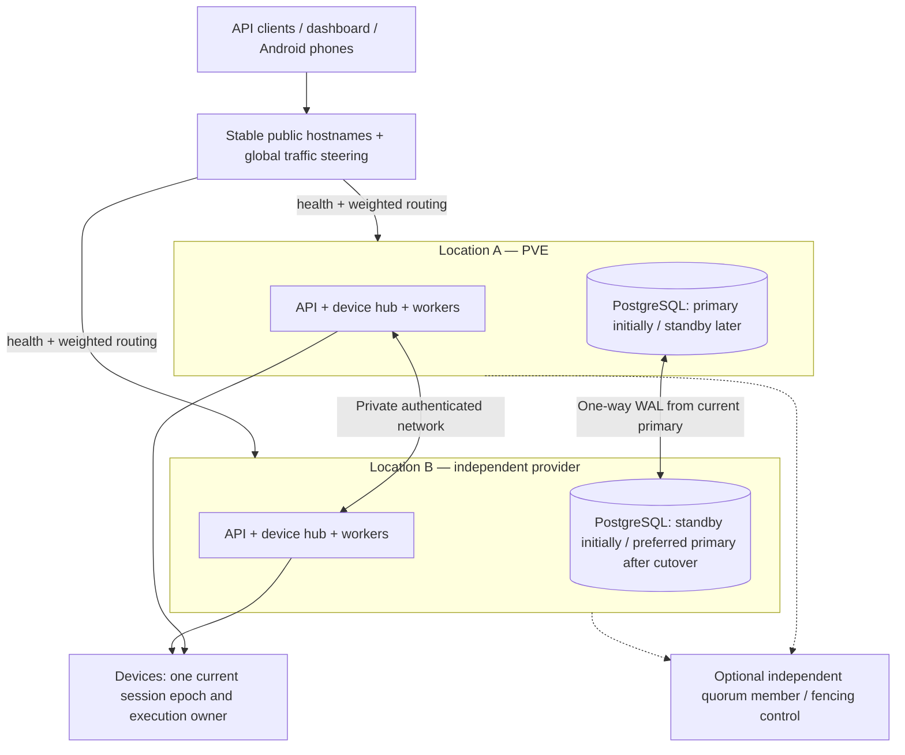

# Two-location operation, traffic steering and failover

ZROtext is designed for traffic routing across two independent locations. Single-site and dual-site configurations share the same application contracts. Two VMs on one host do not provide separate-location resilience.

## Decision

Use **active API/device-hub instances in both locations, one PostgreSQL writer, one standby, and one execution owner per device**. Distinguish routing capacity from database authority. Either site can accept an API request while it can reach the authoritative writer; an isolated site must fail closed for writes and new send grants. The load balancer does not decide who is database primary.

Diagram shows role options, not two writable databases. The same Rust image runs all roles via explicit configuration; separate API/hub/worker processes only when needed. No required cross-region Kubernetes cluster. Each location can use Compose independently. Keep all application behavior public and deployment identifiers private.

## Delivery stages

| Stage | Location A | Location B | Steering / authority |
|---|---|---|---|
| P0: single site | PVE API/hub/workers + writer | Absent | Single origin, portable site-aware contracts |
| P1: second site commissioned | PVE remains writer; active API/hub | Active API/hub + warm standby | Start 100/0, then 90/10 canary; all writes to PVE writer |
| P2: planned authority move | Active API/hub + standby | Active API/hub + writer | Prefer remote, e.g. 20/80 if measured capacity permits |
| P3: mature automatic failover | Active services + DB member | Active services + DB member | Independent quorum/fencing, rehearsed promotion; optional stricter sync mode |

Weights are configuration examples, not measured capacity recommendations. Start with primary/fallback routing and manual DB promotion; enable simultaneous traffic after the two-site failure suite passes. Retain PVE as a useful standby/hub after migration; the move does not require abandoning the original location.

## HTTP routing and device connections

Stable `api.zrotext.com` and `app.zrotext.com` (proposed names). Cloudflare Load Balancing with a pool per location fits the existing edge/tunnel pattern; compare current plan and request/monitor charges before purchase. A self-hosted HAProxy/Envoy ingress is an alternative but a single ingress VPS adds a failure point; DNS-only failover is slower and does not move established sockets. Cloudflare documents health, pool and steering policies separately. [Traffic steering](https://developers.cloudflare.com/load-balancing/understand-basics/traffic-steering/)

First implementation supports health-based failover plus configurable weights. Geo/latency selection can follow measurement: a local API instance still pays the WAN round-trip to the writer, so “nearest API” does not guarantee lower acknowledgment latency. Account/device quotas remain global. Use capacity weights, queue lag and admission control to avoid sending all traffic into an overwhelmed fallback. A stale/offline destination returns bounded 503/429 with retry guidance, never a false 202.

API frontends are stateless except short-lived caches. Both use the writer for idempotency, enrollment, authorization changes, quotas, attempts and outbox; shared cookie signing/encryption key rings and primary-backed sessions allow the browser to move sites. Deploy the same current/previous compatible API/schema versions. Replica reads are optional for explicitly stale-tolerant analytics with visible freshness; never use them for auth revocation, quotas or dispatch.

Prefer edge/internal proxy routing over 307 redirects for send POSTs: do not depend on clients forwarding credentials to another hostname. Retried requests keep the same client-generated message UUID and `Idempotency-Key`. Return that UUID in acknowledgments, events and phone journals. Official SDK retries network errors/503 with bounded backoff and the same identity; it never assumes missing acknowledgment means not sent.

For WebSockets, load balance the initial connection. An established socket stays on its chosen hub until it disconnects; HTTP health routing cannot migrate it. Store `device_sessions(device_id, site_id, hub_id, connection_epoch, lease_until)` in the writer. New authenticated connection obtains a monotonically increasing epoch using a compare-and-swap transaction; the prior socket loses dispatch rights. Optional device `preferred_site_id` is a hint only. No sensitive token in a redirect query string.

Draining a hub stops new claims, completes known active operations, sends a protocol-level `reconnect` hint, closes cleanly and waits for fresh authentication. A device reconnects to the stable hostname with jitter. If explicit site endpoints are later required, use a bounded, preconfigured allowlist and authenticated routing response; a compromised API must not redirect device credentials to arbitrary URLs. Load balancer affinity may improve stability, but database session epochs enforce correctness.

Keep a local socket registry only for the current process. Dispatch workers find ownership through the primary-backed session record and claim jobs for devices connected locally. PostgreSQL notification is an optional wake hint; periodic primary polling is the durable fallback, including across sites. Outbound queues, webhook jobs and usage records are never process-local truth. No NATS requirement at pilot scale.

## Three fences, not one sticky session

1. **Database authority fence:** only the authorized writer accepts mutations. A failover controller must externally fence the old writer and prevent stale restart before promotion. A counter stored independently in each split primary cannot prevent split brain.
2. **Device-session epoch:** only the current authenticated hub session can issue a new execution grant for that device. Test concurrent reconnections to different sites. A disconnected hub with cached state cannot continue dispatching offline.
3. **Attempt identity and local journal:** phone persists the stable message/attempt ID and submitting boundary. If a grant was issued, do not reassign the same send merely because a lease expired. Reconcile old in-flight attempts. The radio can finish an already granted operation during a partition; model it explicitly.

The device must validate grant expiry using bounded server-time offset and current session credentials, and report old-session results without being allowed to request new grants. Message-origin signatures and sealed-content trust still apply independently of operational fences. Hub or edge failover does not require message re-encryption when the destination phone is unchanged; switching phones does.

## Replication, RPO and safety choices

Start dual-location operation with encrypted **asynchronous streaming replication and manual promotion**. Monitor received/replayed WAL, lag seconds/bytes, slot growth and archive freshness. Replication uses a separate private VPN/TLS path and least-privilege replication identity. Same supported PostgreSQL major/build policy at both sites. Do not expose replication on the public Internet. Backups remain necessary: a replica repeats accidental deletion/corruption. [PostgreSQL standby documentation](https://www.postgresql.org/docs/current/warm-standby.html)

Asynchronous replication can lose recently acknowledged data if the writer is destroyed. A 60-second lag alarm is an operational target, **not a bound on all failure-related loss**. Lost data may include idempotency records, quota, auth revocations, grants and callbacks. After unplanned promotion, keep outbound **dispatch paused** until the affected recovery window, key/security state, ledger and device journals are reconciled. Unknown prior sends stay unknown. If the recovered state cannot establish safety, pause the affected account/device rather than resending. Return explicit recovery errors for retries in the uncertain acceptance window; do not treat a missing DB row as permission to send again.

For workloads requiring no loss of acknowledged acceptance/grant records, offer a later **strict synchronous durability mode**: commit relevant transactions only after the designated remote synchronous standby confirms WAL durability; never silently degrade that policy to async. Latency rises by WAN round trips and writes can stop when the remote site is unavailable. Even synchronous database durability does not make the SMS radio boundary exactly once. Apply and test the mode across all safety-critical mutations, not only message inserts.

A supported failover manager such as Patroni plus a properly placed quorum store can automate later stages; evaluate its synchronous/strict semantics rather than writing a bespoke leader-election service. [Replication modes](https://patroni.readthedocs.io/en/latest/replication_modes.html). Do not add Patroni before an operational owner, recovery procedure and failure tests exist.

## Automatic failover needs an independent decision

Two isolated sites alone cannot reliably tell whether the other site died or the link failed. Initially require manual promotion after proving the old writer is stopped/fenced. If it cannot be fenced or its role remains uncertain, preserve write safety and remain unavailable for new sends.

Later use a quorum-based authority across three independent failure domains (for example a supported three-member consensus store: one per workload location plus a lightweight third member) and externally enforceable fencing/watchdog rules. The third member need not run SMS application workloads. A shared CDN and witness provider is a correlated dependency; record it. A simple “ping both sites” script or an arbitrary Worker endpoint is not automatically a correct consensus/fencing system.

The former primary rejoins only as a reseeded/rewound replica after timeline and data checks. Failback is a planned operation with hysteresis, not an automatic flip every time health changes. Route health should require sustained recovery; example 3 failed checks / 5 successful checks and at least 5 minutes stable before restoring traffic, tuned after tests. Never disable fencing to regain availability.

## Health endpoints and failure behavior

`/healthz`: process alive. `/readyz/api`: can authenticate and reach writer in the allowed epoch. `/readyz/hub`: can reach writer, accept sessions, and has capacity. Worker-specific readiness: primary fence/epoch verified and queue lag under bound. Public checks reveal only minimal status; details/metrics stay private. Optional read-only degradation must be clearly separated from write-ready health.

| Failure | Routing behavior | Send/data behavior |
|---|---|---|
| API process down in A | New requests go B | Same writer/idempotency; no new send identity |
| Hub down in A | Phones reconnect via stable endpoint to B | New session epoch; reconcile journal before more grants |
| A↔B link partition; writer in B | A write-readiness fails; route to B | A stops new grants; already granted radio outcomes reconciled |
| Entire writer location lost | Route to healthy UI/read-only or maintenance | No automatic unsafe promotion; fence, recover, reconcile, then write-ready |
| Standby lag / disk full | Alert and stop unsafe promotion candidates | Primary policy dictates continue async or block strict-sync writes |
| All origins unavailable | Edge maintenance/status, bounded retry | Phone buffers events; no implied delivery; no blind retries |
| Stripe event delivered twice/sites switch | Healthy site receives event | Unique event ID + reconcile current subscription on writer |
| Both hubs think they own same phone | DB CAS and phone epoch reject stale owner | Existing ambiguous submission remains unknown |

## Data and deployment additions required now

- Config: `SITE_ID`, `INSTANCE_ID`, writer DSN, site endpoint registry, allowed deployment mode, graceful drain, explicit dispatch enable/fence input. Never hard-code PVE as primary.
- Schema: `sites`, `device_sessions` epoch/lease, device preferred-site hint, global client message UUID and idempotency uniqueness, attempt generation, current deployment epoch, worker leases. Operational epoch must be anchored to external authority when automatic failover is introduced.
- Pure routing/health policy module and injectable site/clock dependencies in tests. Structured event fields include site/instance/epoch; no phone numbers or content in metric labels.
- Two-site local Compose simulation profile: API/hub A and B against one writer; optional standby profile for recovery tests. This does not spend on a second real site or prove geographic resilience.
- Expand/contract migrations; schema migration runs once with a lock and a compatible release. Deploy secondary then primary; never run concurrent incompatible migrations from both sites.
- Secret/key distribution includes independent site operational credentials, shared session verification ring, preserved account public roots and sealed vaults; backups and encryption remain portable. Auth rotation/deletion propagation is safety-critical.
- Future MMS objects need multi-site reachable encrypted storage, replication checks and attachment retention semantics before MMS HA can be claimed.

## Acceptance suite before dual-site traffic

Route 100 requests with a configurable 90/10 weight and verify aggregate behavior without requiring exact per-request distribution. Kill either frontend, drain a hub, move one phone between hubs, drop ACKs, sever the private link, introduce stale session epochs, replay Stripe/webhooks, delay replica WAL, fill standby disk, simulate primary loss, fence/reseed old primary and perform a controlled failback.

Assert: quota and idempotency remain globally consistent; no concurrent radio submission for the same stable message ID; accepted unknowns are surfaced; a site without writer authority issues no new grants; replica lag is visible; failover never enables two writers; both sides of an ambiguous submission cannot retry independently. Capture packet timelines and state-event histories from the simulator, then repeat relevant cases with two real phones.

Set measured targets only after rehearsal: HTTP origin failover goal <60 seconds; device reconnect goal <90 seconds under normal network recovery; initial manual database recovery goal ≤4 hours; RPO depends on selected replication mode and observed state. These are test goals, not launch guarantees. Add cloud LB/monitor, VPN, standby storage, WAL egress, backup and any quorum-member cost to the deployment quote.
