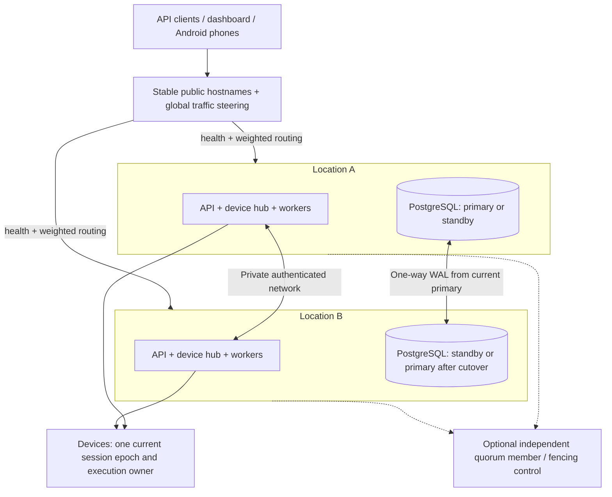

# Two-location operation, traffic steering and failover

ZROtext is designed for traffic routing across two independent locations. Single-site and dual-site configurations share the same application contracts. Two VMs on one host do not provide separate-location resilience.

## Decision

Use **active API/device-hub instances in both locations, one PostgreSQL writer, one standby, and one execution owner per device**. Distinguish routing capacity from database authority. Either site can accept an API request while it can reach the authoritative writer; an isolated site must fail closed for writes and new send grants. The load balancer does not decide who is database primary. Each site must connect to the writer with `sslmode=require` and a certificate matching the writer DNS name; set `DATABASE_TLS_CA_PEM_B64` on both sites if the writer uses a private CA. Replication transport is configured separately from application connections.

```mermaid
flowchart TB
  C[API clients / dashboard / Android phones] --> E[Stable public hostnames + global traffic steering]
  E -->|health + weighted routing| A
  E -->|health + weighted routing| B
  subgraph A[Location A]
    AA[API + device hub + workers]
    AP[(PostgreSQL: primary or standby)]
  end
  subgraph B[Location B]
    BA[API + device hub + workers]
    BP[(PostgreSQL: standby or primary after cutover)]
  end
  AA <-->|Private authenticated network| BA
  AP <-->|One-way WAL from current primary| BP
  A -.-> Q[Optional independent quorum member / fencing control]
  B -.-> Q
  AA --> D[Devices: one current session epoch and execution owner]
  BA --> D
```

Diagram shows role options, not two writable databases. The same Rust image runs all roles via explicit configuration; separate API/hub/worker processes only when needed. No required cross-region Kubernetes cluster. Each location can use Compose independently. Keep all application behavior public and deployment identifiers private.

## Deployment modes

| Mode | Location A | Location B | Steering / authority |
|---|---|---|---|
| Single site | API/hub/workers + writer | Absent | One origin and one writer |
| Two sites | API/hub/workers + writer | API/hub + standby | Weighted traffic; both sites use the same writer |
| Authority moved | API/hub + standby | API/hub/workers + writer | Traffic weights follow capacity and writer location |
| Automatic failover | Active services + DB member | Active services + DB member | Requires independent quorum and fencing |

Weights are configuration examples, not measured capacity recommendations. Primary/fallback routing and manual DB promotion are the simpler operating mode. Both locations can remain useful after authority moves.

## HTTP routing and device connections

Stable API and app hostnames can route to either location. A managed load balancer with a pool per location is one option; HAProxy or Envoy can also steer traffic, but a single ingress host adds a failure point. DNS-only failover is slower and does not move established sockets. [Cloudflare traffic steering](https://developers.cloudflare.com/load-balancing/understand-basics/traffic-steering/) describes one implementation.

First implementation supports health-based failover plus configurable weights. Geo/latency selection can follow measurement: a local API instance still pays the WAN round-trip to the writer, so “nearest API” does not guarantee lower acknowledgment latency. Account/device quotas remain global. Use capacity weights, queue lag and admission control to avoid sending all traffic into an overwhelmed fallback. A stale/offline destination returns bounded 503/429 with retry guidance, never a false 202.

API frontends are stateless except short-lived caches. Both use the writer for idempotency, enrollment, authorization changes, quotas, attempts and outbox; shared cookie signing/encryption key rings and primary-backed sessions allow the browser to move sites. Deploy the same current/previous compatible API/schema versions. Replica reads are optional for explicitly stale-tolerant analytics with visible freshness; never use them for auth revocation, quotas or dispatch.

Prefer edge/internal proxy routing over 307 redirects for send POSTs: do not depend on clients forwarding credentials to another hostname. Retried requests keep the same client-generated message UUID and `Idempotency-Key`. Return that UUID in acknowledgments, events and phone journals. Official SDK retries network errors/503 with bounded backoff and the same identity; it never assumes missing acknowledgment means not sent.

For WebSockets, load balance the initial connection. An established socket stays on its chosen hub until it disconnects; HTTP health routing cannot migrate it. Store `device_sessions(device_id, site_id, hub_id, connection_epoch, lease_until)` in the writer. New authenticated connection obtains a monotonically increasing epoch using a compare-and-swap transaction; the prior socket loses dispatch rights. Optional device `preferred_site_id` is a hint only. No sensitive token in a redirect query string.

Draining a hub stops new claims, completes known active operations, sends a protocol-level `reconnect` hint, closes cleanly and waits for fresh authentication. A device reconnects to the stable hostname with jitter. If explicit site endpoints are later required, use a bounded, preconfigured allowlist and authenticated routing response; a compromised API must not redirect device credentials to arbitrary URLs. Load balancer affinity may improve stability, but database session epochs enforce correctness.

Keep a local socket registry only for the current process. Dispatch workers find ownership through the primary-backed session record and claim jobs for devices connected locally. PostgreSQL notification is an optional wake hint; periodic primary polling is the durable fallback, including across sites. Outbound queues, webhook jobs and usage records are never process-local truth. No NATS requirement at pilot scale.

## Three fences, not one sticky session

1. **Database authority fence:** only the authorized writer accepts mutations. A failover controller must externally fence the old writer and prevent stale restart before promotion. A counter stored independently in each split primary cannot prevent split brain.
2. **Device-session epoch:** only the current authenticated hub session can issue a new execution grant for that device. Test concurrent reconnections to different sites. A disconnected hub with cached state cannot continue dispatching offline.
3. **Attempt identity and local journal:** phone persists the stable message/attempt ID and submitting boundary. If a grant was issued, do not reassign the same send merely because a lease expired. Reconcile old in-flight attempts. The radio can finish an already granted operation during a partition; model it explicitly.

The device must validate grant expiry using bounded server-time offset and current session credentials, and report old-session results without being allowed to request new grants. Message-origin signatures and sealed-content trust still apply independently of operational fences. Hub or edge failover does not require message re-encryption when the destination phone is unchanged; switching phones does.

## Replication, RPO and safety choices

Start dual-location operation with encrypted **asynchronous streaming replication and manual promotion**. Monitor received/replayed WAL, lag seconds/bytes, slot growth and archive freshness. Replication uses a separate private VPN/TLS path and least-privilege replication identity. Same supported PostgreSQL major/build policy at both sites. Do not expose replication on the public Internet. Backups remain necessary: a replica repeats accidental deletion/corruption. [PostgreSQL standby documentation](https://www.postgresql.org/docs/current/warm-standby.html)

Asynchronous replication can lose recently acknowledged data if the writer is destroyed. A 60-second lag alarm is an operational target, **not a bound on all failure-related loss**. Lost data may include idempotency records, quota, auth revocations, grants and callbacks. After unplanned promotion, keep outbound **dispatch paused** until the affected recovery window, key/security state, ledger and device journals are reconciled. Unknown prior sends stay unknown. If the recovered state cannot establish safety, pause the affected account/device rather than resending. Return explicit recovery errors for retries in the uncertain acceptance window; do not treat a missing DB row as permission to send again.

For workloads requiring no loss of acknowledged acceptance/grant records, offer a later **strict synchronous durability mode**: commit relevant transactions only after the designated remote synchronous standby confirms WAL durability; never silently degrade that policy to async. Latency rises by WAN round trips and writes can stop when the remote site is unavailable. Even synchronous database durability does not make the SMS radio boundary exactly once. Apply and test the mode across all safety-critical mutations, not only message inserts.

A supported failover manager such as Patroni plus a properly placed quorum store can automate later stages; evaluate its synchronous/strict semantics rather than writing a bespoke leader-election service. [Replication modes](https://patroni.readthedocs.io/en/latest/replication_modes.html). Do not add Patroni before an operational owner, recovery procedure and failure tests exist.

## Automatic failover needs an independent decision

Two isolated sites alone cannot reliably tell whether the other site died or the link failed. Initially require manual promotion after proving the old writer is stopped/fenced; the [promotion runbook](WRITER-PROMOTION.md) walks through a fenced rehearsal and the manual procedure. If it cannot be fenced or its role remains uncertain, preserve write safety and remain unavailable for new sends.

Later use a quorum-based authority across three independent failure domains (for example a supported three-member consensus store: one per workload location plus a lightweight third member) and externally enforceable fencing/watchdog rules. The third member need not run SMS application workloads. A shared CDN and witness provider is a correlated dependency; record it. A simple “ping both sites” script or an arbitrary Worker endpoint is not automatically a correct consensus/fencing system.

The former primary rejoins only as a reseeded/rewound replica after timeline and data checks. Failback is a planned operation with hysteresis, not an automatic flip every time health changes. Route health should require sustained recovery; example 3 failed checks / 5 successful checks and at least 5 minutes stable before restoring traffic, tuned after tests. A check counts only on new evidence: each counted check needs a majority of members to have reported a fresh observation that no earlier check counted, so one report that stays inside the freshness window across several checks is one check, not several. Never disable fencing to regain availability.

### Implementation status (five increments)

Five deliberately small increments of this design exist in code, disabled by default:

- `crates/failover-quorum` is a pure decision model — no I/O, no network, no database — implementing the promotion-decision rules above as a testable state machine: quorum membership of exactly three members with observation freshness and majority agreement over distinct member identities (duplicate submissions from one member are folded into that member's single vote, a reachable duplicate still vetoes, and positive fencing or readiness evidence from a member counts only when unanimous), where any fresh reachable observation of the writer vetoes promotion; a consecutive failed-check threshold (default 3) before fencing is requested; promotion only after a majority observes the old writer's site fence (`sites.draining` or `enabled = false`), an externally confirmed stop of the old writer, and a ready standby; a promotion epoch strictly above every epoch the controller ever observed, within the signed 64-bit range of `deployment_authority.epoch` (and no promotion at all when none was observed); dispatch that stays paused after promotion until an explicit reconciliation input; and a former writer that may rejoin only as a replica after sustained recovery (default 5 successful checks and 5 minutes stable, one-time). A round without a majority of fresh member votes fails closed and restarts any incomplete hysteresis streak — an unknown interval is not stable evidence — while fences, the promotion epoch and reconciliation state are preserved. Its failure-scenario tests cover writer loss, interrupted failure streaks, quorum loss (including duplicate or conflicting submissions from one member), stale and unknown-member observations, conflicting evidence, missing fencing or standby-readiness evidence, epoch exhaustion, and rejoin flapping.
- The same crate's executor module runs the controller loop and applies decisions to the authoritative writer database through an injected port: fencing sets the old writer's `sites` row draining; promotion holds `deployment_authority`, requires the old writer's fence to still hold, then moves the epoch to exactly the decided value (compare-and-set: never backward, never twice), enables the promoted site and forces dispatch paused in one transaction. The executor has no operation that unpauses dispatch or reverses a fence. A durable journal in the writer database (`failover_controller_state`) records the promotion intent *before* the epoch is touched and the completion after, so a restart resumes the interrupted failover at the exact epoch — crash windows replay idempotently into the compare-and-set instead of double-bumping — and a journal the database cannot back (a restore-from-backup split) fails closed permanently. Its adversarial corpus covers concurrent epoch bumps, wrong-site application, decision replay after restart, crashes between fence and promote, stale evidence from a previous incarnation, configuration changes mid-flight, authority failures with identical-parameter retries, operator interference with the fence, and missing site rows.
- The server parses `FAILOVER_QUORUM_ENABLED` (default off, the same convention as `SMS_LINE_ACTIVATION_ENABLED`) with `FAILOVER_QUORUM_MEMBERS`, `FAILOVER_QUORUM_WRITER_SITE_ID`, `FAILOVER_QUORUM_STANDBY_SITE_ID`, `FAILOVER_QUORUM_CHECK_INTERVAL_MS` and `FAILOVER_QUORUM_STORE_DIR` (an absolute path without `.` or `..` segments; anything else is refused at startup). Off — the default — changes nothing: no thread, no database access, no store directory read. On, every replica spawns one executor thread running the loop with a PostgreSQL-backed port and a file-backed consensus store as its observation source, but the executor is a per-database singleton: the port's single connection must take a session-level PostgreSQL advisory lock (a fixed, documented key) when it opens — and again after every reconnect, because the lock dies with its session — before any operation runs, so exactly one replica executes rounds while every other replica stays dormant, failing each operation closed without a connection, retrying the lock at the check cadence, writing nothing, leaving readiness untouched (a dormant replica is an ordinary API replica) and logging its role once per change rather than per tick. Executor-host failover needs no lease: terminating the previous owner's connection releases the lock, and a dormant replica acquires it on its next retry. Re-acquisition is not a resume: a replica that re-acquires the lock after losing its connection must assume another executor ran in between, so the operation that paid for the acquiring connection fails closed and every later operation fails closed until the executor acknowledges the reload — the check at the top of each tick that discards its cached controller, journal and pending intents and restores from the authority snapshot and the durable journal row (the database's current truth, reconciled against the current epoch, fail-closed where they disagree) before anything runs again. A stale promotion replay can therefore never re-pause dispatch or overwrite the journal row. The store keeps a membership record plus append-only per-member observation journals under the configured directory: records carry store-assigned contiguous sequences and the member identity (a record claiming another identity, a torn trailing record, a sequence gap, a foreign journal or a durable membership that disagrees with the configuration all fail the store closed on open), and rounds are served through the decision model's freshness window, so future-dated or stale observations are never evidence and pre-restart observations are not resurrected. Journals do not grow forever: each journal is compacted — on open and again on every append that pushes it past the bound, so memory and disk stay bounded between opens too — by dropping its leading records that have aged out of the freshness window (measured from the newest observation in that journal), always keeping a bounded floor of records and never a record inside the window; a per-member checkpoint file records the member identity, the last-compacted sequence, the newest compacted timestamp and FNV-1a digest anchors over the compacted prefix and the retained head, the journal rewrite is atomic and journal-first/checkpoint-second (a crash in between leaves a loadable state, never a hybrid), and a torn, malformed, spoofed, contradictory or head-mismatching checkpoint — like a journal continued above one without a checkpoint — fails the store closed on open, while a journal starting at one with no checkpoint is the legacy layout and still loads; an append-time compaction failure is sticky exactly like an append failure (the store fails closed instead of silently growing past the bound). The executor's store source serves each recorded report in at most one check round (a per-member high-water sequence), so the 3 failed checks before fencing and the 5 successful checks before a rejoin are counted in distinct member reports, never in executor ticks that re-read one report while it is still fresh; a check at which no member recorded a new fresh report is a round without quorum and restarts any incomplete streak. When the flag is on and the executor cannot start — the store cannot open (corrupt, foreign membership, unwritable) or the writer-authority port cannot be built — `/readyz` reports `failover_executor_failed` (HTTP 503) until the process is restarted, in addition to the log line; with the flag off readiness is unaffected. In Compose, `app` and `app_b` each mount their own store volume at `/var/lib/zrotext/failover-store`: two executors must never share one store directory. A store that fails mid-append stays failed and serves empty rounds, so the controller can only lose quorum and hold. The optional authenticated HTTPS adapter carries explicitly signed member observations into the store when configured; without that private configuration, production reporting abstains. The crate also defines the interface for anchoring the operational epoch to an external authority (monotonic, refuses backward promotions) with a test implementation only — no external anchoring exists yet.

- The same crate's `fence` module (issue #647) defines the external writer-fencing and epoch-authority adapter interfaces the promotion binding requires: a `FenceAuthority` for external host fencing — idempotent under a per-promotion fence token, refusal-only (an absent, unconfirmed, timed-out or partitioned authority answers "unconfirmed", never an error a caller could read as success), with no unfence operation because reversing a fence is a manual operator action — and an `ExternalEpochAnchor` extending the epoch-anchor contract with the confirmation concept. The executor's promote path now requires, after the durable write-ahead intent and before the epoch compare-and-set, a confirmed external fence under the promotion's own token and a confirmed anchored epoch the promotion strictly exceeds (the one exception being the idempotent completion replay, which the authority must already serve); a successful promotion is then witnessed into the anchor after the compare-and-set, so an anchor that lags can only force later refusals, never authorize anything. Restore reads the confirmed anchor before the authority snapshot — the order makes a concurrent promotion's commit visible to the snapshot but never to the earlier anchor read — and fails closed permanently (`EpochAnchorAhead`) when the anchor is ahead of the authority row: the independent second witness of a database restored from an older backup, a split the journal alone cannot catch when it was restored with the database. The one-time rejoin record is bound the same way: it is journaled only when the confirmed anchor backs the promoted epoch. The only shipped fence implementation is the fail-closed `NoopFenceAuthority`, so with the wiring enabled every promotion is refused at the external-fence precondition — no external fencing backend exists yet, and adding one is an explicit future change. The real shipped epoch adapter is server-side: `PgExternalEpochAnchor` witnesses `deployment_authority.epoch` on its own dedicated connection under the singleton row's lock discipline (`FOR SHARE` against the promote transaction's `FOR UPDATE`) and records a promotion only when the row already serves it — the anchor follows the authority forward and never writes the epoch. Stated plainly: because that anchor lives in the same database as the authority, it cannot witness a whole-database restore; it is the seam a truly external authority plugs into without further executor changes.
- The same crate's `observe` module is the reporter half of the member-reporting transport: pure logic, over injected raw probe outcomes (writer epoch read, old-writer site fence, external stop confirmation, standby readiness, former-writer health), that forms one member's quorum report per round — or abstains. Its fail-closed rules: only a definitive connection failure is an unreachable vote, so a member-local probe fault (configuration, DNS, TLS, authentication, driver error) abstains from the round entirely and a faulty member can neither veto with a phantom reachable vote nor push the quorum toward fencing a healthy writer; an epoch the `deployment_authority` schema cannot hold (zero, or above the signed 64-bit range) is a probe fault, never an observation; evidence is per-round — only probes that completed and answered contribute, nothing carries over between rounds, and an unanswered probe is absence of evidence, never negative evidence; and a round that observed the writer alive carries no stop-confirmation evidence, because a member never attests a live writer and a stopped one at once. The member identity is bound at construction and stamped on every report, and one round yields at most one report.
- The same crate's `report` module plus its server wiring invoke that observer: a member-side probe-and-report loop, behind the same default-off `FAILOVER_QUORUM_ENABLED` flag, turns each round of probes into a report and carries it into the durable consensus store. The loop is pure over two injected seams — a `ProbeSource` (one round of raw outcomes per call; the optional HTTPS adapter supplies authenticated production inputs) and an `ObservationSink` implemented as a thin adapter over the store's append path, so the store remains the only writer of its journals. Abstaining rounds submit nothing. A sink failure fails the loop closed **sticky** for reporting, mirroring the store's own poisoning philosophy: probes continue every round but nothing more is reported until an explicit recovery or restart, because a report that may not have been durably recorded must never be silently retried into a second journal record. The loop keeps no cross-round memory, so a restart resumes from the durable journal without double-reporting a round. Enabling the module additionally reads three strictly-parsed variables, all ignored while the flag is off: `FAILOVER_QUORUM_PROBE_INTERVAL_MS` (positive; defaults to the check interval), `FAILOVER_QUORUM_PROBE_TIMEOUT_MS` (positive, required) and `FAILOVER_QUORUM_REPORT_MEMBER_ID` (must be one of the configured members; anything else fails startup closed). When enabled, the reporting thread runs alongside the executor thread over one shared store handle and both stop at the graceful-drain flag. The optional [authenticated observation transport](../protocol/v1/quorum-observation-transport.md) supplies bounded explicit HTTPS probe inputs and exchanges pinned, signed member reports with durable replay fencing. It remains unconfigured by default; without its private configuration the source abstains. A failed request never asserts an external fence, stop confirmation or unreachable writer. The configured observation authority must supply those explicit facts. This increment also fixed the store's journal codec to represent every evidence combination the observer can form: a suppressed middle field (a live writer carries no stop confirmation) is recorded as `-`, while journals written before the sentinel still load.
Not implemented yet: deployment-specific observation/watchdog authority, external writer fencing and a durable epoch-anchor adapter; automatic activation requires their separate gates. The optional signed HTTPS transport carries explicit observations and preserves default-off behavior. Promotion remains the manual, fenced procedure in [WRITER-PROMOTION.md](WRITER-PROMOTION.md). Two-site deployment evidence, chained failover and planned failback remain open.

## Health endpoints and failure behavior

`/healthz`: process alive. `/readyz/api`: can authenticate and reach writer in the allowed epoch. `/readyz/hub`: can reach writer, accept sessions, and has capacity. Worker-specific readiness: primary fence/epoch verified and queue lag under bound. Public checks reveal only minimal status; details/metrics stay private. Optional read-only degradation must be clearly separated from write-ready health.

| Failure | Routing behavior | Send/data behavior |
|---|---|---|
| API process down in A | New requests go B | Same writer/idempotency; no new send identity |
| Hub down in A | Phones reconnect via stable endpoint to B | New session epoch; reconcile journal before more grants |
| A↔B link partition; writer in B | A write-readiness fails; route to B | A stops new grants; already granted radio outcomes reconciled |
| Entire writer location lost | Route to healthy UI/read-only or maintenance | No automatic unsafe promotion; fence, recover, reconcile, then write-ready |
| Standby lag / disk full | Alert and stop unsafe promotion candidates | Primary policy dictates continue async or block strict-sync writes |
| All origins unavailable | Edge maintenance/status, bounded retry | Phone buffers events; no implied delivery; no blind retries |
| Stripe event delivered twice/sites switch | Healthy site receives event | Unique event ID + reconcile current subscription on writer |
| Both hubs think they own same phone | DB CAS and phone epoch reject stale owner | Existing ambiguous submission remains unknown |

## Site-aware contracts

- Config: `SITE_ID`, `INSTANCE_ID`, writer DSN, site endpoint registry, allowed deployment mode, graceful drain, explicit dispatch enable/fence input. Never hard-code one location as primary.
- Schema: `sites`, `device_sessions` epoch/lease, device preferred-site hint, global client message UUID and idempotency uniqueness, attempt generation, current deployment epoch, worker leases. Operational epoch must be anchored to external authority when automatic failover is introduced.
- Pure routing/health policy module and injectable site/clock dependencies in tests. Structured event fields include site/instance/epoch; no phone numbers or content in metric labels.
- Two-site local Compose simulation profile: API/hub A and B against one writer; optional standby profile for recovery tests. This does not spend on a second real site or prove geographic resilience.
- Expand/contract migrations; schema migration runs once with a lock and a compatible release. Deploy secondary then primary; never run concurrent incompatible migrations from both sites.
- Secret/key distribution includes independent site operational credentials, shared session verification ring, preserved account public roots and sealed vaults; backups and encryption remain portable. Auth rotation/deletion propagation is safety-critical.
- Future MMS objects need multi-site reachable encrypted storage, replication checks and attachment retention semantics before MMS HA can be claimed.

## Failure scenarios

Route 100 requests with a configurable 90/10 weight and verify aggregate behavior without requiring exact per-request distribution. Kill either frontend, drain a hub, move one phone between hubs, drop ACKs, sever the private link, introduce stale session epochs, replay Stripe/webhooks, delay replica WAL, fill standby disk, simulate primary loss, fence/reseed old primary and perform a controlled failback.

Run `cargo run --locked -p zrotext-device-sim` for a deterministic two-hub matrix covering dropped acceptance/result acknowledgments, writer loss with paused dispatch, stale hub sessions, and lease expiry/reconnect. Its JSON timelines assert one shared writer, no blind regrant of an ambiguous message, and at most one modeled radio call per stable message. This pure model does not simulate PostgreSQL promotion, network packet loss, Android radio behavior, or geographic failure; those require separate integration and device tests.

The PostgreSQL-backed server regression `device_socket::tests::lost_intent_ack_across_hubs_needs_no_radio_proof_before_regrant` exercises a synthetic grant on hub A, a lost durable-intent ACK, hub B taking the device session, an unknown timeout that retains the fence, and a durable no-radio proof before a new attempt. Run it with `ZT_AUTH_TEST_DATABASE_URL` pointed at a disposable PostgreSQL database. It tests writer and socket grant logic without Android, a carrier, network packet loss, or database promotion.

Assert: quota and idempotency remain globally consistent; no concurrent radio submission for the same stable message ID; accepted unknowns are surfaced; a site without writer authority issues no new grants; replica lag is visible; failover never enables two writers; both sides of an ambiguous submission cannot retry independently. Capture packet timelines and state-event histories from the simulator, then repeat relevant cases with two real phones.

HTTP origin failover, device reconnect, and database recovery depend on the chosen network and replication setup. Document measured behavior for each deployment.
