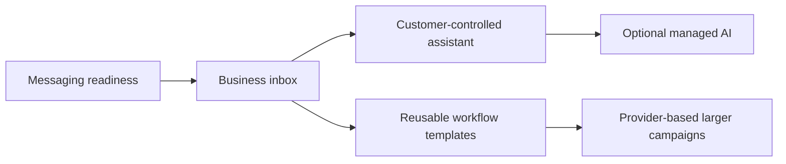

# Product implementation plan

**Proposal; no customer workflow in this document is available yet.** This plan connects the [technical roadmap](ROADMAP.md) to the [use-case catalog](USE-CASES.md). It adds delivery order and acceptance criteria without changing the current API, enabling SMS, or accepting an unfinished sealed-content protocol.

The first complete experiences are a text receptionist for local service operators and a personal assistant that works in both directions. Nontechnical owners use the dashboard; developers and automation tools use the same services. The initial deployment uses a dedicated Android phone and SIM, one owner per account, small contact lists and an authorized customer-controlled connector.

## Current foundation

The gateway has restricted send/inbound pilots, signed webhook delivery, account controls, a device dashboard, self-hosting foundations and test-mode billing. Recent merged work adds:

- [MFA-bound SMS approval public-key registration and revocation](../protocol/v1/sms-line-activation-contract.md) ([#240](https://github.com/pboachie/zrotext/pull/240)). The internal activation functions are not connected to a production activation route.
- A [default-off line-bound opt-out stream](../protocol/v1/line-opt-out-contract.md) with durable Android upload/replay identity. It carries STOP/review metadata; it is not general inbound message content.
- An [owner-only read-only queue](SMS-COMPLIANCE.md#gate-for-general-sending) for ambiguous SMS holds ([#237](https://github.com/pboachie/zrotext/pull/237)). It cannot clear a hold or record an off-channel withdrawal.

Production line activation, off-channel holds and review decisions, general inbound content, sealed messaging and the stable public API remain open. The [device compatibility record](DEVICE-COMPATIBILITY.md) describes limited controlled evidence, not a supported-device or capacity guarantee. The [sealed decision log](../protocol/drafts/zt-009-decision-log.md) remains authoritative for Q1-Q11; external paid review is not a prerequisite replacing those technical gates.

## Implementation under review

The following slices have reviewable implementations. They are pull requests, not merged capability or release evidence; the roadmap's release stages and general-send gates stay unchanged until review and the required runtime verification are complete.

| Slice | Review | Scope and remaining boundary |
|---|---|---|
| Off-channel holds and review decisions | [#242](https://github.com/pboachie/zrotext/pull/242) | Durable owner API and audit records; neither decision manually lifts suppression. |
| Owner controls and queued-message cancellation | [#245](https://github.com/pboachie/zrotext/pull/245), stacked on #242 | Dashboard forms, cancellation before a radio grant, usage refunds, and suppression recheck at grant time. Already granted work may finish. |
| Synthetic workflow demo | [#244](https://github.com/pboachie/zrotext/pull/244) | Service inquiry, wedding RSVP, and personal reminder simulations with draft approval, handoff, opt-out, and honest delivery states. Scripted drafts only; no SMS or AI provider connected. |

Review #242 before its #245 follow-up. The demo can be reviewed independently. Production line activation, general inbound content, sealed messaging, durable workflow services, and real-device evidence remain the next runtime gates.

## Delivery sequence

Each slice should have its own focused implementation and verification changes. Synthetic prototypes can be developed before the foundation is complete, but customer sending depends on the [general sending gates](ROADMAP.md#path-to-general-sending).

### Messaging readiness

Complete authenticated SMS line activation using the merged owner-key ceremony and Android proof groundwork. Bind the selected subscription, pause on uncertain SIM identity, and exercise revocation and generation changes. Finish off-channel withdrawal intake and durable review decisions; the read-only queue alone does not complete this work.

Resolve the remaining sealed profile decisions and implement interoperable outbound and unsolicited inbound content. Publish the stable API and TypeScript SDK with client-side encryption, authenticated integration scope and signed webhooks. Preserve the distinction between metadata-only STOP events and decrypted customer replies.

**Exit criteria:** a controlled real-device cycle covers enrollment, activation, send, reply, opt-out, reconnect, replay and revocation. Sealed-content, recovery and leakage checks pass. Publish supported-device limitations and route-specific capacity evidence before admitting customer workflows. Do not infer a general release from one controlled run.

### Business inbox

Deliver the first complete non-AI journey: inquiry → intake → owner response → follow-up. An owner connects a line, adds contacts and permitted message purposes, records job or appointment details, previews a message, and tracks replies and exceptions from one dashboard.

| Capability | Initial behavior |
|---|---|
| Contacts and consent | Manual entry and CSV import with normalization, duplicate review, source/purpose/time of permission, and suppression visibility. Importing a number does not establish consent. |
| Conversations | Account- and line-scoped history, related job or appointment context, and an owner exceptions queue. Message content is decrypted at authorized clients. |
| Templates and scheduling | Personalization and SMS-segment preview; owner-selected recipient timezone, sending window, pacing and expiry. When recipient timing is unknown, hold scheduled automation for owner review. |
| Approvals | Bind the decision to the exact action, recipient, content and timing. Editing a draft invalidates earlier approval. Record the resulting message or failure. |
| Reply tracking | Match responses to the relevant active request; route unclear matches to the owner. Stop applicable reminders after a response, cancellation or withdrawal. |

The scheduler stores approved encrypted work plus minimal routing/timing metadata. A changing template or contextual follow-up requires an available authorized client or connector to render and encrypt it; the relay does not need message plaintext. If that process is offline, show the waiting state and honor expiry. Check suppression and current permission again before dispatch, including already queued work.

**Exit criteria:** an owner completes the full journey without developer assistance. Restarting workers or replaying a webhook does not duplicate messages. Offline devices, expired reminders, cancelled jobs and post-scheduling opt-outs produce visible, correct outcomes. `unknown` never becomes an automatic retry or a claimed delivery.

### Customer-controlled assistant

Add an authorized connector that decrypts selected inbound conversations, calls the customer's chosen AI, and encrypts outbound content through the SDK. Use existing line-restricted integration authority; finish its registration, expiry, revocation and recovery gates before runtime use. Sending permission and reading permission are separate grants.

The dashboard lets the owner configure contacts, service facts, hours, allowed routines, message/AI budgets and escalation rules. The first assistant can answer its owner, capture notes and reminders, ask approved intake questions, and answer approved FAQs. The same connector can serve an existing assistant through scoped tools.

| Action | Initial authority |
|---|---|
| Owner conversation, approved FAQ, intake question or reminder | Automatic only within the selected contacts, approved routine, sending window and budget. |
| Quote, booking, payment request, promise or other commitment | Queue for authenticated owner approval of the exact action. |
| Unexpected request, uncertain reply, new recipient or permission change | Escalate to the owner; incoming SMS cannot grant authority. |
| Human takeover, opt-out, exhausted budget or revoked connector | Stop automatic work and expose the reason in the dashboard. |

Treat model output as a proposed action. Enforce permissions outside the model, isolate conversation context, deduplicate inbound events, and cap automatic turns to prevent loops. A paired phone number can identify a candidate owner conversation but cannot alone authorize sensitive operations. Require the authenticated owner interface for approvals and permission changes.

**Exit criteria:** the assistant completes an allowed routine and both directions of an owner conversation. Adversarial SMS cannot broaden scope, reveal other conversations or bypass approval. Provider errors, timeouts and human takeover do not trigger uncontrolled messages. Selected-content access and revocation are visible to the owner.

### Workflow templates

Publish repair updates, cancellation-slot offers, events/RSVPs and volunteer coordination using the shared services. The [catalog](USE-CASES.md) defines each journey and acceptance criteria. Household coordination, lending and operational acknowledgment remain later candidates until pilots establish demand.

Start with owner-entered jobs, appointments, availability and groups. External calendar, CRM, payment and inventory connections are separate integrations; a text reply does not itself change those external systems. Capacity-sensitive workflows must atomically reserve the slot, shift or item, expire outstanding offers and handle late replies. The first versions keep business commitments under owner confirmation.

Provide an n8n recipe using its documented [Webhook](https://docs.n8n.io/integrations/builtin/core-nodes/n8n-nodes-base.webhook/) and [HTTP Request](https://docs.n8n.io/integrations/builtin/core-nodes/n8n-nodes-base.httprequest/) nodes. The authorized connector verifies the webhook signature and event identity, decrypts selected content, and signs/encrypts permitted outbound work. A generic HTTP node is not a substitute for the SDK's encryption or authorization. Clearly document which customer processes and chosen providers can read content.

**Exit criteria:** templates configure existing services rather than inventing separate message queues or bypassing suppression. Concurrent acceptances cannot overbook. Batch previews identify duplicates and segments, keep recipients private, and show per-message outcomes. RSVP export depends on the planned export capability.

### Managed AI and larger campaigns

These are independent later additions, not prerequisites for the customer-controlled assistant.

**Managed AI:** require explicit opt-in to a separate ZROtext-managed content reader. Specify selected lines/conversations, model-provider access, retention, export, deletion, revocation and budgets. The service must receive explicitly authorized decryption/signing roles; it must not introduce a silent plaintext fallback to the sealed API. Revocation stops future access but cannot undo content already read. Complete hosted-service operations and the relevant export/deletion capability before release.

**Larger campaigns:** evaluate a provider-based transport with explicit route selection. Document supported countries, sender eligibility, number ownership/portability, registration needs, cost units and measured throughput for the chosen route. Do not imply every provider can send from an existing SIM number. Preserve suppression, idempotency, expiry, pacing and honest delivery states across routes. An unknown phone submission must not be resent through a provider automatically.

**Exit criteria:** demonstrate each new service or route independently with its trust boundary and limits. Publish capacity only after testing the actual route. Keep phone-based workflows usable without requiring these optional services.

## Planned interfaces and data boundaries

These are capability contracts for later implementation, not new live routes or database migrations.

| Surface | Minimum capability |
|---|---|
| Contacts | Manage recipients, permitted purposes, suppression and import outcomes within one account. |
| Conversations | Retrieve scoped history and ciphertext with related workflow metadata; no relay plaintext search. |
| Scheduled actions | Preview, approve, schedule, expire and cancel work with recipient timing and idempotency. |
| Decisions and replies | Record authenticated approvals, match replies, take over a conversation and inspect unresolved outcomes. |
| Integration tools | Read authorized events, propose permitted actions, and query status with distinct read/send grants and line scope. |
| Workflow events | Stable event identity and signed delivery for received replies, action state changes and approval outcomes; consumers deduplicate. |

Dashboard and integration clients use the same account-scoped services and admission rules. Keep contact names, conversation text, template content and job details encrypted to authorized readers; store only the necessary routing, timing, consent and workflow metadata at the relay, with explicit retention. Public SMS transport and visible phone-number metadata remain subject to the [security design](SECURITY-DESIGN.md). An AI connection expands the set of content readers only through an explicit grant.

## Validation and release evidence

| Area | Required scenarios |
|---|---|
| Messaging | Duplicate events, phone downtime, process restart, expired reminders, cancellation races, unknown outcomes and late receipts. |
| Consent | Withdrawal after scheduling, off-channel withdrawal, ambiguous replies, scoped consent and no automatic restart from a new import. |
| Timing and text | Explicit recipient timezone, daylight-saving transitions, sending windows, Unicode/segment bounds and preview-to-send consistency. |
| Assistant | Unauthorized sender, prompt injection, cross-conversation disclosure, out-of-scope recipient, stale approval, loops, budget exhaustion and key revocation. |
| Workflow | Concurrent acceptances, expired offers, household RSVP ambiguity, duplicate contacts, completed tasks and closed incidents. |
| Content boundary | Synthetic canaries absent from relay database, logs and webhook envelopes; readable only by explicitly authorized clients/services. |

Pilot reports should record setup completion, time to first successful task, completed conversations, owner interventions, corrections, unwanted messages and repeat use. The catalog's success signals guide measurement; no adoption or savings claims are established yet. Keep customer identities and raw transcripts private, and publish only generic limitations and reproducible synthetic acceptance results.

Keep releases evidence-driven: capabilities advance on implementation and tests; a use case advances only when its direct and upstream dependencies and general sending gates are ready. A hosted offering also requires the hosted-service capability. A release changes the catalog's availability explicitly; it is not inferred from a new design document.

## Keeping the plan current

Edit capability stages, dependencies, use-case priorities, journeys and acceptance criteria in [roadmap.json](roadmap.json). Run `python3 scripts/roadmap.py` to update the README summary, roadmap, catalog and SVG. Run its `--check` mode and the roadmap tests before submitting a change. CI checks generated output and rejects dangling use-case requirements, cyclic dependencies and premature availability claims.

Change this plan when an implementation slice or data boundary changes. Link merged behavior and its tests from the roadmap, separate restricted pilots from general support, and retain the user-visible limitation until the corresponding release evidence exists.
