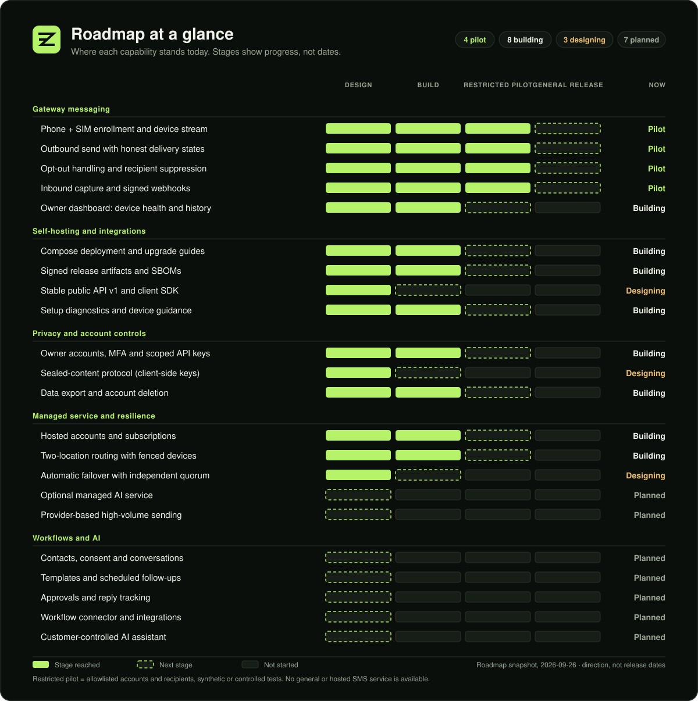
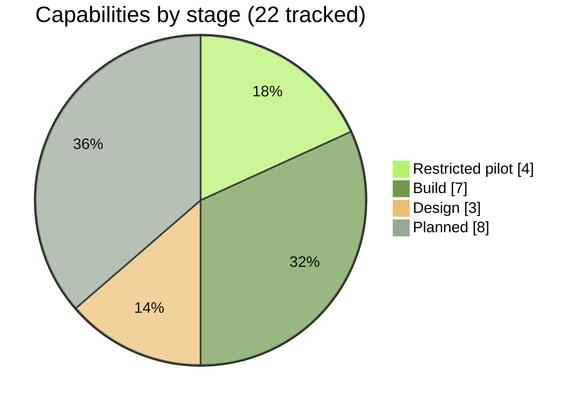
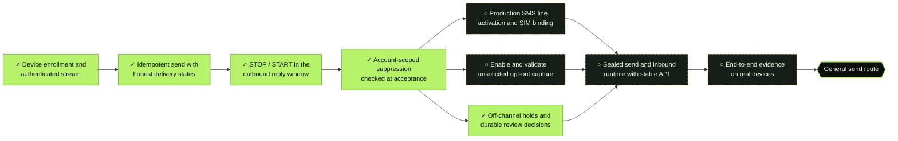
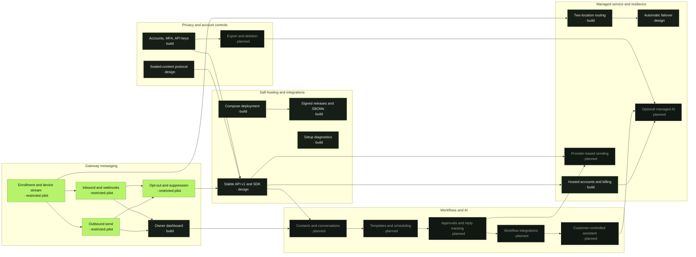
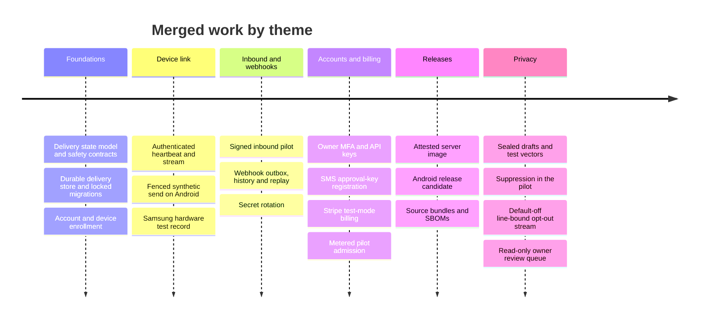

# Roadmap

ZROtext is an open-source Android SMS gateway in active development. This page shows where each capability stands and what it depends on. Stages describe progress, not release dates or a promise that every feature is available today. Contributions are welcome through [issues and pull requests](../CONTRIBUTING.md).

<!-- Generated regions come from docs/roadmap.json. Edit that file, then run `python3 scripts/roadmap.py`. -->

<!-- roadmap:overview -->

<!-- /roadmap:overview -->

> [!NOTE]
> **How to read the stages**
> - **Planned:** a proposed capability and intended outcomes are recorded; implementation has not started.
> - **Design:** a written design, protocol draft or test vectors exist. Nothing runs in the gateway yet.
> - **Build:** code is merged and tested in CI or local rehearsals. It is not ready for real traffic.
> - **Restricted pilot:** runs end to end only for allowlisted accounts and recipients, using synthetic or controlled tests.
> - **General release:** documented, supported and available for the stated deployment mode. No capability has reached this stage.

## Customer outcomes

The first experiences focus on local service operators and a personal assistant that works in both directions. A dashboard and integrations share one messaging foundation. The [use-case catalog](USE-CASES.md) describes each journey, dependencies and acceptance criteria; the [product implementation plan](PRODUCT-PLAN.md) orders the work.

Priority is delivery order, not availability or a release date. These outcomes are separate from the capability counts below.

<!-- roadmap:usecases -->
| Priority | Experience | Example | Availability |
|---|---|---|---|
| First | [Text receptionist](USE-CASES.md#receptionist) | Gather job details by text, draft a reply, and ask the owner to approve a quote. | Proposed; unavailable |
| First | [Personal AI by SMS](USE-CASES.md#personalai) | Text your assistant a note or reminder; let approved routines communicate with selected contacts. | Proposed; unavailable |
| Next | [Repair and project updates](USE-CASES.md#repairs) | Send a repair update and request approval before extra work. | Proposed; unavailable |
| Next | [Cancellation-slot recovery](USE-CASES.md#waitlist) | Offer an open slot in sequence and stop when one booking is confirmed. | Proposed; unavailable |
| Next | [Wedding and event concierge](USE-CASES.md#events) | Send personalized invitations, collect RSVPs, and remind only unanswered guests. | Proposed; unavailable |
| Next | [Volunteer and shift coordination](USE-CASES.md#volunteers) | Fill an open shift by text and stop requests once it is covered. | Proposed; unavailable |
| Later | [Household coordinator](USE-CASES.md#household) | Coordinate pickups, errands and recurring responsibilities through opt-in reminders and replies. | Proposed; unavailable |
| Later | [Community lending desk](USE-CASES.md#lending) | Request equipment by text, confirm availability, and receive return reminders. | Proposed; unavailable |
| Later | [Operational acknowledgment](USE-CASES.md#acknowledgment) | Notify a small team about a maintenance issue and record who will handle it. | Proposed; unavailable |
<!-- /roadmap:usecases -->

## At a glance

<!-- roadmap:summary -->

| Track | General release | Restricted pilot | Build | Design | Planned |
|---|:---:|:---:|:---:|:---:|:---:|
| [Gateway messaging](#gateway-messaging) |  | 4 | 1 |  |  |
| [Self-hosting and integrations](#self-hosting-and-integrations) |  |  | 3 | 1 |  |
| [Privacy and account controls](#privacy-and-account-controls) |  |  | 1 | 1 | 1 |
| [Managed service and resilience](#managed-service-and-resilience) |  |  | 2 | 1 | 2 |
| [Workflows and AI](#workflows-and-ai) |  |  |  |  | 5 |
<!-- /roadmap:summary -->

## Path to general sending

General, non-allowlisted sending is the most important gate on this roadmap. It stays closed until every item on the left is done. The [SMS compliance guide](SMS-COMPLIANCE.md#gate-for-general-sending) explains the opt-out requirements; the [product plan](PRODUCT-PLAN.md#messaging-readiness) also requires the sealed messaging runtime and stable API. Internal line-bound opt-out code and the read-only review queue are groundwork, not completion of the remaining gates.

<!-- roadmap:gate -->

✓ marks work done in the restricted pilot; ○ marks work still open.
<!-- /roadmap:gate -->

## How the tracks connect

Arrows show the main dependencies between tracks. Labels include the current stage, so the diagram does not rely on color.

<!-- roadmap:map -->

<!-- /roadmap:map -->

<!-- roadmap:tracks -->
## Gateway messaging

Connect a dedicated Android phone and SIM, send and receive SMS through the server, and report outcomes honestly.

| Capability | Stage | Evidence |
|---|---|---|
| Phone + SIM enrollment and device stream | Restricted pilot | [#9](https://github.com/pboachie/zrotext/pull/9), [#24](https://github.com/pboachie/zrotext/pull/24), [#160](https://github.com/pboachie/zrotext/pull/160), [device compatibility](DEVICE-COMPATIBILITY.md) |
| Outbound send with honest delivery states | Restricted pilot | [#17](https://github.com/pboachie/zrotext/pull/17), [#19](https://github.com/pboachie/zrotext/pull/19), [#21](https://github.com/pboachie/zrotext/pull/21) |
| Opt-out handling and recipient suppression | Restricted pilot | [#207](https://github.com/pboachie/zrotext/pull/207), [#210](https://github.com/pboachie/zrotext/pull/210), [line-bound stream](../protocol/v1/line-opt-out-contract.md), [#237](https://github.com/pboachie/zrotext/pull/237), [#242](https://github.com/pboachie/zrotext/pull/242), [#245](https://github.com/pboachie/zrotext/pull/245), [#247](https://github.com/pboachie/zrotext/pull/247) |
| Inbound capture and signed webhooks | Restricted pilot | [#25](https://github.com/pboachie/zrotext/pull/25), [#29](https://github.com/pboachie/zrotext/pull/29), [#39](https://github.com/pboachie/zrotext/pull/39), [#80](https://github.com/pboachie/zrotext/pull/80) |
| Owner dashboard: device health and history | Build | [#36](https://github.com/pboachie/zrotext/pull/36), [#74](https://github.com/pboachie/zrotext/pull/74), [#76](https://github.com/pboachie/zrotext/pull/76), [#237](https://github.com/pboachie/zrotext/pull/237), [#245](https://github.com/pboachie/zrotext/pull/245), [#251](https://github.com/pboachie/zrotext/pull/251), [#255](https://github.com/pboachie/zrotext/pull/255) |

<b>Phone + SIM enrollment and device stream</b> · restricted pilot

- [x] One-use pairing with code and key-fingerprint comparison
- [x] P-256 device keys in Android Keystore with challenge-response sign-in
- [x] Authenticated WebSocket stream with heartbeats, fenced session epochs and bounded reconnects
- [x] Opt-in heartbeat resumes after a phone reboot
- [x] Controlled test on one Samsung device and SIM ([compatibility notes](DEVICE-COMPATIBILITY.md))
- [ ] Longer liveness runs across networks, carriers and device models
- [ ] Supported-device guidance

<b>Outbound send with honest delivery states</b> · restricted pilot

- [x] Durable idempotency keys and per-account admission budgets
- [x] One radio operation at a time, with an execution grant bound to device, attempt and recipient
- [x] Ambiguous submissions become `unknown` and are never retried automatically ([state model](ARCHITECTURE.md#message-semantics-and-the-duplicate-send-problem))
- [x] Allowlisted synthetic send route (`/v1/alpha/messages`)
- [ ] Planned public `/v1/messages` route that accepts sealed content
- [ ] Open to any account, after the [path to general sending](#path-to-general-sending) is complete

<b>Opt-out handling and recipient suppression</b> · restricted pilot

- [x] STOP, STOPALL, UNSUBSCRIBE and similar keywords recognized in the outbound reply window
- [x] Likely free-text withdrawals create a conservative block marked for review
- [x] Account-scoped suppression checked when a message is accepted
- [x] Local block on the phone applies immediately, even while offline
- [x] Local line binding and unsolicited opt-outs journaled on the phone ([#210](https://github.com/pboachie/zrotext/pull/210))
- [x] Default-off signed line-bound STOP/review stream and durable Android replay identity; production activation remains open
- [x] Owner-only read-only queue for ambiguous SMS holds ([#237](https://github.com/pboachie/zrotext/pull/237))
- [x] Owner-recorded off-channel holds and durable review decisions; a hold or signed opt-out cancels queued sends that have no radio grant ([#242](https://github.com/pboachie/zrotext/pull/242), [#245](https://github.com/pboachie/zrotext/pull/245))
- [x] A signed START releases a hold only when observed more than five minutes after it, tightened by the phone clock reading at upload ([#250](https://github.com/pboachie/zrotext/pull/250), [#253](https://github.com/pboachie/zrotext/pull/253))
- [x] Owner-approved SMS line activation implemented end to end, off by default: browser-held approval key, signed phone declaration and Android install ([#247](https://github.com/pboachie/zrotext/pull/247), [#248](https://github.com/pboachie/zrotext/pull/248), [#251](https://github.com/pboachie/zrotext/pull/251))
- [ ] Validate SMS line activation on physical SIMs, then enable it before unsolicited opt-outs
- [ ] End-to-end opt-out, offline replay and SIM-change evidence on real devices

<b>Inbound capture and signed webhooks</b> · restricted pilot

- [x] Bounded inbound SMS pilot on Android with signed metadata upload
- [x] Durable webhook outbox with HMAC signatures, retries and bounded manual replay
- [x] Webhook signing secrets encrypted at rest, with key rotation ([runbook](WEBHOOK-KEK-ROTATION.md))
- [x] Retention limits for inbound content and delivery history
- [ ] General unsolicited message-content capture and conversation routing beyond the pilot reply window; the line-bound STOP path carries metadata only
- [ ] Reliable inbound when senders use RCS ([details](ANDROID-TESTING.md))
- [ ] Sealed inbound content delivered to customer decryptors

<b>Owner dashboard: device health and history</b> · build

- [x] Device pairing and management page
- [x] Authenticated connection lease shown per device
- [x] Message state timeline, inbound activity and webhook history views
- [x] Read-only ambiguous opt-out review queue with recipient metadata and event times
- [x] Opt-out hold and review decision forms ([#245](https://github.com/pboachie/zrotext/pull/245))
- [x] SMS lines page: approval key, line list and activation approval ([#251](https://github.com/pboachie/zrotext/pull/251), [#255](https://github.com/pboachie/zrotext/pull/255))
- [ ] SIM, queue depth and radio readiness per device
- [ ] Live updates instead of snapshots

## Self-hosting and integrations

Make ZROtext practical to run, upgrade and build against.

| Capability | Stage | Evidence |
|---|---|---|
| Compose deployment and upgrade guides | Build | [#35](https://github.com/pboachie/zrotext/pull/35), [#105](https://github.com/pboachie/zrotext/pull/105), [#173](https://github.com/pboachie/zrotext/pull/173), [#183](https://github.com/pboachie/zrotext/pull/183), [#259](https://github.com/pboachie/zrotext/pull/259) |
| Signed release artifacts and SBOMs | Build | [#86](https://github.com/pboachie/zrotext/pull/86), [#135](https://github.com/pboachie/zrotext/pull/135), [#169](https://github.com/pboachie/zrotext/pull/169), [#197](https://github.com/pboachie/zrotext/pull/197) |
| Stable public API v1 and client SDK | Design | [API outline](ARCHITECTURE.md#planned-api-v1-outline), [test-only sealed reader](../sdk/typescript/README.md) |
| Setup diagnostics and device guidance | Build | [#81](https://github.com/pboachie/zrotext/pull/81), [#189](https://github.com/pboachie/zrotext/pull/189) |

<b>Compose deployment and upgrade guides</b> · build

- [x] Complete Compose stack with migrations before API start ([guide](../deploy/compose/README.md))
- [x] Separate migration and restricted runtime database roles
- [x] Verified PostgreSQL TLS and an optional HTTPS edge
- [x] Scripted fresh-install and database restore rehearsals
- [x] Upgrade guide for moving between source snapshots ([guide](../deploy/compose/UPGRADE.md))
- [ ] Upgrade notes for each tagged release
- [ ] Production hardening checklist

<b>Signed release artifacts and SBOMs</b> · build

- [x] Server image built from one source bundle, pinned and scanned
- [x] Release receipts gated on approved identity and SBOMs
- [x] Android release candidate with signing-key custody checks
- [ ] First tagged public release ([process](RELEASING.md))

<b>Stable public API v1 and client SDK</b> · design

- [x] Route outline and sealed send shape ([outline](ARCHITECTURE.md#planned-api-v1-outline))
- [x] Versioned device stream schema aligned with the wire format
- [ ] OpenAPI contract for `/v1/messages`, `/v1/devices`, `/v1/webhooks` and `/v1/usage`
- [ ] TypeScript SDK with local encryption, after the sealed protocol is finalized

<b>Setup diagnostics and device guidance</b> · build

- [x] Owner enrollment, account setup and mail diagnostics
- [x] SMS and RCS readiness guidance for the gateway phone
- [ ] Accessibility review of owner pages and the Android app
- [ ] Supported-device list backed by repeatable tests

## Privacy and account controls

Keep message content out of reach of the server, and give owners control of their account and data.

| Capability | Stage | Evidence |
|---|---|---|
| Owner accounts, MFA and scoped API keys | Build | [#43](https://github.com/pboachie/zrotext/pull/43), [#172](https://github.com/pboachie/zrotext/pull/172), [#175](https://github.com/pboachie/zrotext/pull/175), [MFA operations](MFA-OPERATIONS.md), [#240](https://github.com/pboachie/zrotext/pull/240) |
| Sealed-content protocol (client-side keys) | Design | [Draft 01](../protocol/drafts/zt-sealed-draft-01.md), [draft 02 proposal](../protocol/drafts/zt-sealed-draft-02-proposal.md), [#159](https://github.com/pboachie/zrotext/pull/159), [#162](https://github.com/pboachie/zrotext/pull/162), [#260](https://github.com/pboachie/zrotext/pull/260) |
| Data export and account deletion | Planned | [Data retention](SELF-HOSTING.md#data-retention) covers history pruning only |

<b>Owner accounts, MFA and scoped API keys</b> · build

- [x] Verified-email owner registration with closed-by-default policy
- [x] MFA, session revocation and CSRF protection
- [x] API keys with scopes, shown once at creation
- [x] MFA-bound SMS approval public-key registration and revocation; line activation remains an internal prerequisite ([contract](../protocol/v1/sms-line-activation-contract.md))
- [ ] Team seats beyond one owner
- [ ] Account recovery flows separate from content recovery

<b>Sealed-content protocol (client-side keys)</b> · design

- [x] Draft protocol and validation gates
- [x] TypeScript and Android test vectors, including signed manifests and root rotation
- [x] Test-only envelope parser and Android Keystore boundary
- [x] Q1-Q11 decisions recorded with cross-client manifest vectors ([#260](https://github.com/pboachie/zrotext/pull/260))
- [ ] Verify the recorded Q1-Q11 decisions with the evidence each row still lists in the [protocol decision log](../protocol/drafts/zt-009-decision-log.md)
- [ ] Cross-client interoperability and adversarial security tests
- [ ] Recovery and unlock flows
- [ ] Enabled in the gateway for real messages

<b>Data export and account deletion</b> · planned

- [ ] Owner export of messages, events and settings
- [ ] Account erasure that covers metering and billing records where allowed
- [ ] Extend export and erasure to future contacts, templates, workflow state and assistant access records

## Managed service and resilience

Offer an operated service built from the same public code, and keep it available across two locations.

| Capability | Stage | Evidence |
|---|---|---|
| Hosted accounts and subscriptions | Build (Stripe test mode only) | [#34](https://github.com/pboachie/zrotext/pull/34), [#44](https://github.com/pboachie/zrotext/pull/44), [#70](https://github.com/pboachie/zrotext/pull/70), [#184](https://github.com/pboachie/zrotext/pull/184) |
| Two-location routing with fenced devices | Build | [#73](https://github.com/pboachie/zrotext/pull/73), [design](MULTI-LOCATION.md) |
| Automatic failover with independent quorum | Design | [Failover design](MULTI-LOCATION.md#automatic-failover-needs-an-independent-decision) |
| Optional managed AI service | Planned | [product proposal](PRODUCT-PLAN.md#managed-ai-and-larger-campaigns) proposal only; no runtime implementation |
| Provider-based high-volume sending | Planned | [product proposal](PRODUCT-PLAN.md#managed-ai-and-larger-campaigns) proposal only; no runtime implementation |

<b>Hosted accounts and subscriptions</b> · build, Stripe test mode only

- [x] Stripe Checkout and Customer Portal in test mode
- [x] Signed event inbox with risk holds for refunds and disputes
- [x] Metered admission for billed pilot tenants
- [ ] Live payments, usage limits and plans
- [ ] Customer support and status communication

<b>Two-location routing with fenced devices</b> · build

- [x] One authoritative database writer with site-aware device leases
- [x] Virtual two-hub fault matrix, including unknown attempts across a hub move
- [x] Local second API instance through the Compose `two-hub` profile
- [ ] Rehearsed manual writer promotion between real sites

<b>Automatic failover with independent quorum</b> · design

- [x] Design requiring an independent quorum member and fencing control
- [ ] Implementation and failure-scenario tests

<b>Optional managed AI service</b> · planned

- [ ] Explicit opt-in to a separate managed AI service that can read selected content
- [ ] Document provider access, retention, export, deletion, revocation and per-account budgets

<b>Provider-based high-volume sending</b> · planned

- [ ] Evaluate provider routes, supported regions and sender-number requirements before promising capacity
- [ ] Explicit route selection with shared suppression, idempotency and delivery semantics; no automatic resend of unknown phone attempts

## Workflows and AI

Build useful conversations for local service operators and individuals through the dashboard and integrations. These capabilities are proposed and unavailable; they depend on the general messaging foundation.

| Capability | Stage | Evidence |
|---|---|---|
| Contacts, consent and conversations | Planned | [product proposal](PRODUCT-PLAN.md#business-inbox) proposal only; no runtime implementation |
| Templates and scheduled follow-ups | Planned | [product proposal](PRODUCT-PLAN.md#business-inbox) proposal only; no runtime implementation |
| Approvals and reply tracking | Planned | [product proposal](PRODUCT-PLAN.md#business-inbox), [synthetic demo PR #244](https://github.com/pboachie/zrotext/pull/244) proposal only; scripted approval and handoff simulation in #244; no runtime implementation |
| Workflow connector and integrations | Planned | [product proposal](PRODUCT-PLAN.md#customer-controlled-assistant) proposal only; no runtime implementation |
| Customer-controlled AI assistant | Planned | [product proposal](PRODUCT-PLAN.md#customer-controlled-assistant) proposal only; no runtime implementation |

<b>Contacts, consent and conversations</b> · planned

- [ ] Contacts with purpose-specific consent records, duplicate handling and conversation history
- [ ] Owner-entered job or appointment details and an exceptions inbox, with locally decrypted content

<b>Templates and scheduled follow-ups</b> · planned

- [ ] Personalized templates, segment preview, recipient-local timing and explicit expiry
- [ ] Paced scheduling with suppression rechecks, cancellation and honest unknown outcomes

<b>Approvals and reply tracking</b> · planned

- [ ] Durable owner decisions tied to the exact recipient and proposed action
- [ ] Reply correlation, human takeover and follow-up cancellation after a response

<b>Workflow connector and integrations</b> · planned

- [ ] Shared services for dashboard actions, SDK tools and signed workflow events
- [ ] Authorized encryption/decryption connector with signature verification and event deduplication
- [ ] An n8n recipe for connecting the shared messaging services; application templates have separate use-case acceptance criteria

<b>Customer-controlled AI assistant</b> · planned

- [ ] Selected conversations decrypted only by an authorized customer-controlled connector
- [ ] Two-way owner conversations and automatic replies within approved routines
- [ ] Escalate commitments and unusual requests; enforce budgets, scope, revocation and human takeover

<!-- /roadmap:tracks -->

## What has landed

## Where to help

> [!TIP]
> Useful contributions right now:
> - Synthetic walkthroughs of the [first customer journeys](USE-CASES.md), especially intake, approval and follow-up. Keep customer data out of public reports.
> - Device test reports from other Android models and carriers. Follow [Android testing](ANDROID-TESTING.md) and keep personal numbers out of reports.
> - Review of the [sealed-content drafts](../protocol/drafts/zt-sealed-draft-02-proposal.md).
> - Accessibility feedback on the owner pages in `web/owner`.
> - Self-hosting feedback from the [Compose guide](../deploy/compose/README.md).
>
> Read [CONTRIBUTING.md](../CONTRIBUTING.md) before opening a pull request.

See the [architecture](ARCHITECTURE.md), [two-location design](MULTI-LOCATION.md) and [security design](SECURITY-DESIGN.md) for technical details. These documents describe a mix of implemented and proposed behavior; inspect the code and release notes for availability.

Stages, checklists, dependencies and use cases live in [roadmap.json](roadmap.json). To change them, edit that file and run `python3 scripts/roadmap.py`; it regenerates the graphic, charts, tables and use-case details on this page, in the catalog and in the README. CI fails if they are out of date or a use case claims availability before its prerequisites.
