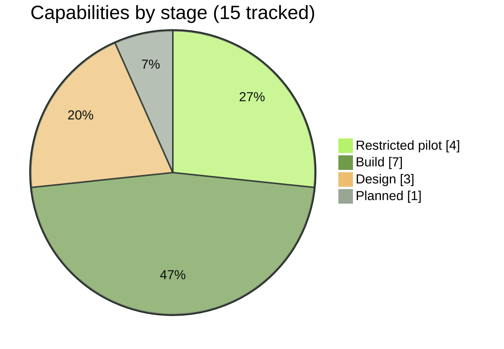
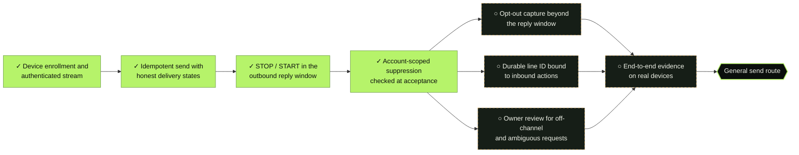
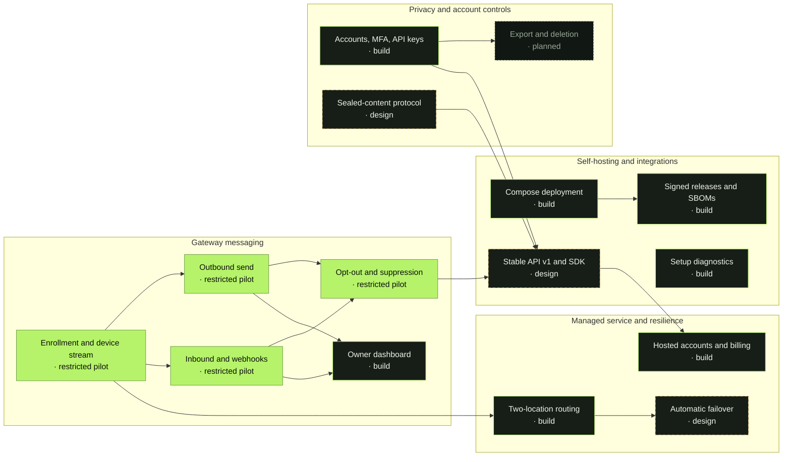
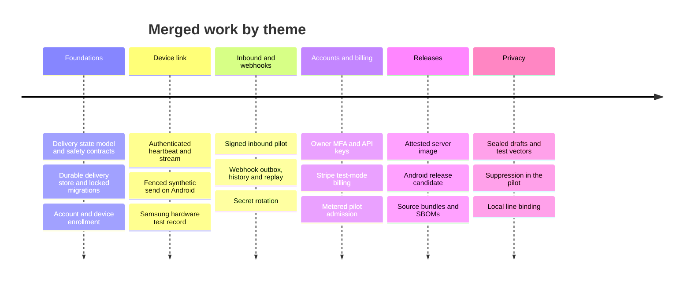

# Roadmap

ZROtext is an open-source Android SMS gateway in active development. This page shows where each capability stands and what it depends on. Stages describe progress, not release dates or a promise that every feature is available today. Contributions are welcome through [issues and pull requests](../CONTRIBUTING.md).

<!-- Generated regions come from docs/roadmap.json. Edit that file, then run `python3 scripts/roadmap.py`. -->

<!-- roadmap:overview -->

<!-- /roadmap:overview -->

> [!NOTE]
> **How to read the stages**
> - **Design:** a written design, protocol draft or test vectors exist. Nothing runs in the gateway yet.
> - **Build:** code is merged and tested in CI or local rehearsals. It is not ready for real traffic.
> - **Restricted pilot:** runs end to end only for allowlisted accounts and recipients, using synthetic or controlled tests.
> - **General release:** documented, supported and open to any self-hosted operator. No capability has reached this stage.

## At a glance

<!-- roadmap:summary -->

| Track | General release | Restricted pilot | Build | Design | Planned |
|---|:---:|:---:|:---:|:---:|:---:|
| [Gateway messaging](#gateway-messaging) |  | 4 | 1 |  |  |
| [Self-hosting and integrations](#self-hosting-and-integrations) |  |  | 3 | 1 |  |
| [Privacy and account controls](#privacy-and-account-controls) |  |  | 1 | 1 | 1 |
| [Managed service and resilience](#managed-service-and-resilience) |  |  | 2 | 1 |  |
<!-- /roadmap:summary -->

## Path to general sending

General, non-allowlisted sending is the most important gate on this roadmap. It stays closed until every item on the left is done. The [SMS compliance guide](SMS-COMPLIANCE.md#gate-for-general-sending) has the full reasoning.

<!-- roadmap:gate -->

✓ marks work done in the restricted pilot; ○ marks work still open.
<!-- /roadmap:gate -->

## How the tracks connect

Arrows show the main dependencies between tracks. Labels include the current stage, so the diagram does not rely on color.

<!-- roadmap:map -->

<!-- /roadmap:map -->

<!-- roadmap:tracks -->
## Gateway messaging

Connect a dedicated Android phone and SIM, send and receive SMS through the server, and report outcomes honestly.

| Capability | Stage | Evidence |
|---|---|---|
| Phone + SIM enrollment and device stream | Restricted pilot | [#9](https://github.com/pboachie/zrotext/pull/9), [#24](https://github.com/pboachie/zrotext/pull/24), [#160](https://github.com/pboachie/zrotext/pull/160), [device compatibility](DEVICE-COMPATIBILITY.md) |
| Outbound send with honest delivery states | Restricted pilot | [#17](https://github.com/pboachie/zrotext/pull/17), [#19](https://github.com/pboachie/zrotext/pull/19), [#21](https://github.com/pboachie/zrotext/pull/21) |
| Opt-out handling and recipient suppression | Restricted pilot | [#207](https://github.com/pboachie/zrotext/pull/207), [#210](https://github.com/pboachie/zrotext/pull/210) |
| Inbound capture and signed webhooks | Restricted pilot | [#25](https://github.com/pboachie/zrotext/pull/25), [#29](https://github.com/pboachie/zrotext/pull/29), [#39](https://github.com/pboachie/zrotext/pull/39), [#80](https://github.com/pboachie/zrotext/pull/80) |
| Owner dashboard: device health and history | Build | [#36](https://github.com/pboachie/zrotext/pull/36), [#74](https://github.com/pboachie/zrotext/pull/74), [#76](https://github.com/pboachie/zrotext/pull/76) |

<b>Phone + SIM enrollment and device stream</b> · restricted pilot

- [x] One-use pairing with code and key-fingerprint comparison
- [x] P-256 device keys in Android Keystore with challenge-response sign-in
- [x] Authenticated WebSocket stream with heartbeats, fenced session epochs and bounded reconnects
- [x] Opt-in heartbeat resumes after a phone reboot
- [x] Controlled test on one Samsung device and SIM ([compatibility notes](DEVICE-COMPATIBILITY.md))
- [ ] Longer liveness runs across networks, carriers and device models
- [ ] Supported-device guidance

<b>Outbound send with honest delivery states</b> · restricted pilot

- [x] Durable idempotency keys and per-account admission budgets
- [x] One radio operation at a time, with an execution grant bound to device, attempt and recipient
- [x] Ambiguous submissions become `unknown` and are never retried automatically ([state model](ARCHITECTURE.md#message-semantics-and-the-duplicate-send-problem))
- [x] Allowlisted synthetic send route (`/v1/alpha/messages`)
- [ ] Planned public `/v1/messages` route that accepts sealed content
- [ ] Open to any account, after the [path to general sending](#path-to-general-sending) is complete

<b>Opt-out handling and recipient suppression</b> · restricted pilot

- [x] STOP, STOPALL, UNSUBSCRIBE and similar keywords recognized in the outbound reply window
- [x] Likely free-text withdrawals create a conservative block marked for review
- [x] Account-scoped suppression checked when a message is accepted
- [x] Local block on the phone applies immediately, even while offline
- [x] Local line binding and unsolicited opt-outs journaled on the phone ([#210](https://github.com/pboachie/zrotext/pull/210))
- [ ] Authenticated capture beyond the outbound reply window
- [ ] Durable line ID bound to server-side inbound actions
- [ ] Owner workflow for off-channel and ambiguous requests

<b>Inbound capture and signed webhooks</b> · restricted pilot

- [x] Bounded inbound SMS pilot on Android with signed metadata upload
- [x] Durable webhook outbox with HMAC signatures, retries and bounded manual replay
- [x] Webhook signing secrets encrypted at rest, with key rotation ([runbook](WEBHOOK-KEK-ROTATION.md))
- [x] Retention limits for inbound content and delivery history
- [ ] Reliable inbound when senders use RCS ([details](ANDROID-TESTING.md))
- [ ] Sealed inbound content delivered to customer decryptors

<b>Owner dashboard: device health and history</b> · build

- [x] Device pairing and management page
- [x] Authenticated connection lease shown per device
- [x] Message state timeline, inbound activity and webhook history views
- [ ] SIM, queue depth and radio readiness per device
- [ ] Live updates instead of snapshots

## Self-hosting and integrations

Make ZROtext practical to run, upgrade and build against.

| Capability | Stage | Evidence |
|---|---|---|
| Compose deployment and upgrade guides | Build | [#35](https://github.com/pboachie/zrotext/pull/35), [#105](https://github.com/pboachie/zrotext/pull/105), [#173](https://github.com/pboachie/zrotext/pull/173), [#183](https://github.com/pboachie/zrotext/pull/183) |
| Signed release artifacts and SBOMs | Build | [#86](https://github.com/pboachie/zrotext/pull/86), [#135](https://github.com/pboachie/zrotext/pull/135), [#169](https://github.com/pboachie/zrotext/pull/169), [#197](https://github.com/pboachie/zrotext/pull/197) |
| Stable public API v1 and client SDK | Design | [API outline](ARCHITECTURE.md#planned-api-v1-outline), [test-only sealed reader](../sdk/typescript/README.md) |
| Setup diagnostics and device guidance | Build | [#81](https://github.com/pboachie/zrotext/pull/81), [#189](https://github.com/pboachie/zrotext/pull/189) |

<b>Compose deployment and upgrade guides</b> · build

- [x] Complete Compose stack with migrations before API start ([guide](../deploy/compose/README.md))
- [x] Separate migration and restricted runtime database roles
- [x] Verified PostgreSQL TLS and an optional HTTPS edge
- [x] Scripted fresh-install and database restore rehearsals
- [ ] Upgrade guide covering every release
- [ ] Production hardening checklist

<b>Signed release artifacts and SBOMs</b> · build

- [x] Server image built from one source bundle, pinned and scanned
- [x] Release receipts gated on approved identity and SBOMs
- [x] Android release candidate with signing-key custody checks
- [ ] First tagged public release ([process](RELEASING.md))

<b>Stable public API v1 and client SDK</b> · design

- [x] Route outline and sealed send shape ([outline](ARCHITECTURE.md#planned-api-v1-outline))
- [x] Versioned device stream schema aligned with the wire format
- [ ] OpenAPI contract for `/v1/messages`, `/v1/devices`, `/v1/webhooks` and `/v1/usage`
- [ ] TypeScript SDK with local encryption, after the sealed protocol is reviewed

<b>Setup diagnostics and device guidance</b> · build

- [x] Owner enrollment, account setup and mail diagnostics
- [x] SMS and RCS readiness guidance for the gateway phone
- [ ] Accessibility review of owner pages and the Android app
- [ ] Supported-device list backed by repeatable tests

## Privacy and account controls

Keep message content out of reach of the server, and give owners control of their account and data.

| Capability | Stage | Evidence |
|---|---|---|
| Owner accounts, MFA and scoped API keys | Build | [#43](https://github.com/pboachie/zrotext/pull/43), [#172](https://github.com/pboachie/zrotext/pull/172), [#175](https://github.com/pboachie/zrotext/pull/175), [MFA operations](MFA-OPERATIONS.md) |
| Sealed-content protocol (client-side keys) | Design | [Draft 01](../protocol/drafts/zt-sealed-draft-01.md), [draft 02 proposal](../protocol/drafts/zt-sealed-draft-02-proposal.md), [#159](https://github.com/pboachie/zrotext/pull/159), [#162](https://github.com/pboachie/zrotext/pull/162) |
| Data export and account deletion | Planned | [Data retention](SELF-HOSTING.md#data-retention) covers history pruning only |

<b>Owner accounts, MFA and scoped API keys</b> · build

- [x] Verified-email owner registration with closed-by-default policy
- [x] MFA, session revocation and CSRF protection
- [x] API keys with scopes, shown once at creation
- [ ] Team seats beyond one owner
- [ ] Account recovery flows separate from content recovery

<b>Sealed-content protocol (client-side keys)</b> · design

- [x] Draft protocol and validation gates
- [x] TypeScript and Android test vectors, including signed manifests and root rotation
- [x] Test-only envelope parser and Android Keystore boundary
- [ ] External review of the chosen suite
- [ ] Recovery and unlock flows
- [ ] Enabled in the gateway for real messages

<b>Data export and account deletion</b> · planned

- [ ] Owner export of messages, events and settings
- [ ] Account erasure that covers metering and billing records where allowed

## Managed service and resilience

Offer an operated service built from the same public code, and keep it available across two locations.

| Capability | Stage | Evidence |
|---|---|---|
| Hosted accounts and subscriptions | Build (Stripe test mode only) | [#34](https://github.com/pboachie/zrotext/pull/34), [#44](https://github.com/pboachie/zrotext/pull/44), [#70](https://github.com/pboachie/zrotext/pull/70), [#184](https://github.com/pboachie/zrotext/pull/184) |
| Two-location routing with fenced devices | Build | [#73](https://github.com/pboachie/zrotext/pull/73), [design](MULTI-LOCATION.md) |
| Automatic failover with independent quorum | Design | [Failover design](MULTI-LOCATION.md#automatic-failover-needs-an-independent-decision) |

<b>Hosted accounts and subscriptions</b> · build, Stripe test mode only

- [x] Stripe Checkout and Customer Portal in test mode
- [x] Signed event inbox with risk holds for refunds and disputes
- [x] Metered admission for billed pilot tenants
- [ ] Live payments, usage limits and plans
- [ ] Customer support and status communication

<b>Two-location routing with fenced devices</b> · build

- [x] One authoritative database writer with site-aware device leases
- [x] Virtual two-hub fault matrix, including unknown attempts across a hub move
- [x] Local second API instance through the Compose `two-hub` profile
- [ ] Rehearsed manual writer promotion between real sites

<b>Automatic failover with independent quorum</b> · design

- [x] Design requiring an independent quorum member and fencing control
- [ ] Implementation and failure-scenario tests

<!-- /roadmap:tracks -->

## What has landed

## Where to help

> [!TIP]
> Useful contributions right now:
> - Device test reports from other Android models and carriers. Follow [Android testing](ANDROID-TESTING.md) and keep personal numbers out of reports.
> - Review of the [sealed-content drafts](../protocol/drafts/zt-sealed-draft-02-proposal.md).
> - Accessibility feedback on the owner pages in `web/owner`.
> - Self-hosting feedback from the [Compose guide](../deploy/compose/README.md).
>
> Read [CONTRIBUTING.md](../CONTRIBUTING.md) before opening a pull request.

See the [architecture](ARCHITECTURE.md), [two-location design](MULTI-LOCATION.md) and [security design](SECURITY-DESIGN.md) for technical details. These documents describe a mix of implemented and proposed behavior; inspect the code and release notes for availability.

Stages, checklists and dependencies live in [roadmap.json](roadmap.json). To change them, edit that file and run `python3 scripts/roadmap.py`; it regenerates the graphic, charts and tables on this page and in the README. CI fails if they are out of date.
