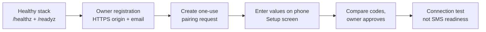

# Self-hosting ZROtext

The repository includes a local Docker Compose stack for development and evaluation. It starts PostgreSQL, runs migrations, and serves the Rust API. SMS dispatch is disabled by default; bringing up the stack does not connect a phone or send a message.

## Local setup

Install Docker and Docker Compose, copy [`.env.example`](../.env.example) to `.env`, and replace the example PostgreSQL password in both `POSTGRES_PASSWORD` and `DATABASE_URL` with the same local value. Independently generate 32 random bytes as 64 hexadecimal characters for `RUNTIME_DATABASE_PASSWORD` (for example, `openssl rand -hex 32`). The API uses this restricted runtime role; the migration role remains separate. From the repository root:

```sh
docker compose --env-file .env -f deploy/compose/compose.yaml up -d --build
curl http://127.0.0.1:8080/healthz
curl http://127.0.0.1:8080/readyz
```

The [Compose guide](../deploy/compose/README.md) covers migrations, volumes, shutdown, and the optional second local API instance. Local health checks establish process and database availability, not SMS delivery.

### From a healthy stack to a phone



1. Configure the exact HTTPS account origin and verification mail, then follow [owner registration](#owner-registration). Open `/owner/account` for account and MFA controls and `/owner/devices` for the fleet overview.
2. Create a one-use pairing request in the owner dashboard. On the phone, use the gear menu to open **Setup**, review access purposes separately, and enter the pairing values. Compare the phone and browser before owner approval. Pairing can proceed without a SIM or SMS access; connection controls currently require a selected SIM.
3. Treat **Connection** as an explicit test/control surface. A socket connection or heartbeat does not establish SMS readiness. The controlled SMS pilot requires its separate documented authority and a recipient you control; do not enable it merely to evaluate the UI.
4. Treat sealed conversation onboarding as ongoing integration work. Phone custody, enrollment and browser components have bounded test coverage; these do not establish a complete production provisioning path. Follow the exact release limitations and [current interface guide](INTERFACE.md).

For a packaged Android artifact, start at the [published releases](https://github.com/pboachie/zrotext/releases), review the matching receipts and checksums, and use the [release bundle procedure](RELEASE-BUNDLE.md). A local build of development `main` can differ from the published app even when the displayed version name matches.

For a disposable fresh-install check, run `python deploy/compose/fresh_install_smoke.py` from the repository root (`python3` on systems where that is the Python command). It creates a separate Compose project with a generated local database password and an available loopback port, checks migrations and both health endpoints, runs the logical restore rehearsal, and removes its containers, volume, and temporary credentials. It never uses your `.env` or sends SMS.

The smoke stops its API before inserting synthetic tenants, devices, queued and failed messages, an attempt, an idempotency key, and usage records. It verifies those records in a new database-only restore project. Run the same script with the immutable image digest, source commit, and release tag as described in the [Compose guide](../deploy/compose/README.md) to rehearse the published server image.

## Running your own deployment

Use separate secrets and a private database network, terminate HTTPS and WSS at a trusted edge, keep migrations serialized, and retain recoverable database backups. The server, Android gateway, and device protocol are evolving; test the exact release and phone model you intend to run. The [architecture](ARCHITECTURE.md) describes the database and device ownership model, while [MULTI-LOCATION.md](MULTI-LOCATION.md) describes how a second site can join without creating an independent writer; the [promotion runbook](WRITER-PROMOTION.md) covers the fenced manual move of the writer.

### Public HTTPS and device WSS

The optional Compose `edge` profile runs Caddy in front of the API. Point a DNS
name at the host and allow inbound TCP 80 and 443 for certificate issuance and
HTTPS. In your private `.env`, set `EDGE_DOMAIN` to that name and set
`AUTH_ORIGIN=https://<that exact name>` (no trailing slash). Generate independent
random `AUTH_TOKEN_PEPPER_B64` and `ENROLLMENT_TOKEN_PEPPER_B64` values as
described in `.env.example`, keep them stable across restarts and restores, and
configure verification SMTP before registering an owner. Then run:

```sh
docker compose --env-file .env --profile edge -f deploy/compose/compose.yaml up -d --build
curl https://<your-domain>/healthz
curl https://<your-domain>/readyz
```

`AUTH_ORIGIN` must equal the browser's exact public HTTPS origin, including a
port when using a nonstandard public HTTPS port. Account mutations reject any
other `Origin`. The API remains bound to host loopback on `APP_PORT`; Caddy
forwards `Host` and WebSocket upgrades to `app:8080`. The Android gateway uses
`wss://<your-domain>/v1/device-stream` and needs a certificate issued by a CA
the phone already trusts. A local Caddy certificate or a user-installed CA is
only suitable for local tests; ordinary Android apps do not trust user-added CAs
by default. Keep the `caddy_data` volume so certificate state survives restarts.
The edge permits long-lived streams for up to 24 hours and delays forced closure
for five minutes during a Caddy reload; gateway reconnection still remains
necessary. The edge compresses (`zstd` or `gzip`) only the static dashboard
assets: `GET`/`HEAD` requests under `/owner/*`, `/billing` and
`/billing/dashboard.js` whose response is HTML, CSS, JavaScript or a font.
That shrinks each owner-dashboard load from about 93 KB to roughly 21 KB. API
and JSON responses are never compressed, because some carry one-time secrets
(API keys, pairing tokens, MFA setup) and compression would expose a
BREACH-style length side channel; the `/owner/events` live-update stream and
the `/v1/device-stream` WebSockets are never compressed or buffered. If you
front the API with a different proxy, keep the same path and content-type
allowlist and never compress `/v1/` responses. Owner JS/CSS assets revalidate with a strong `ETag`, so a repeat
load answers `304` with no body once the assets are cached. Apply per-source
connection limits upstream before exposing the
device stream broadly, as described under runtime capacity below.

For an existing nginx TLS edge, proxy ordinary requests and
`/v1/device-stream` to `http://127.0.0.1:8080`. Preserve the original `Host` and
`Origin` headers; for the device path use HTTP/1.1, forward `Upgrade` and
`Connection: upgrade`, and set read and send timeouts above the 30-second
heartbeat (for example, 90 seconds). A minimal device location is:

```nginx
location /v1/device-stream {
    proxy_pass http://127.0.0.1:8080;
    proxy_http_version 1.1;
    proxy_set_header Host $http_host;
    proxy_set_header Upgrade $http_upgrade;
    proxy_set_header Connection "upgrade";
    proxy_read_timeout 90s;
    proxy_send_timeout 90s;
}
```

The nginx server also needs its trusted `ssl_certificate` and
`ssl_certificate_key`, a normal `location /` proxy to the same API, and the same
canonical public origin in `AUTH_ORIGIN`. To test the Compose edge without a
public domain or a phone, install Python's `cryptography` package with Argon2id
support, then run `python deploy/compose/edge_smoke.py`. It creates
a disposable loopback-only stack, trusts only its temporary Caddy local CA,
creates a synthetic verified owner with a freshly generated passphrase in its
own database, checks HTTPS sign-in,
secure session cookies and exact-Origin handling, then performs a WSS upgrade
and removes the test containers and volumes. It does not send mail or SMS.

Production packaging instructions will expand as release artifacts become
available. For now, use this stack as a development environment, check the
repository's releases for supported versions, and follow the
[Compose upgrade guide](../deploy/compose/UPGRADE.md) when moving an existing
deployment to a newer source snapshot or release image.

### PostgreSQL transport TLS

For a database outside the local Compose network, use a DNS name in each
`DATABASE_URL` that matches the server certificate and append `sslmode=require`.
The API, migrator, and `zrotext-webhook-kek-rewrap` then require TLS and verify
both the certificate chain and hostname. By default they trust the host's
system root store. Set `DATABASE_TLS_CA_PEM_B64` to the base64 encoding of a
private PEM CA bundle instead; pass it to every relevant container. Restart
processes after changing CA trust. For example:

```sh
DATABASE_URL='postgres://zrotext_runtime:<secret>@writer.example.com:5432/zrotext?sslmode=require'
DATABASE_TLS_CA_PEM_B64='<base64-encoded-PEM-CA-bundle>'
```

Accepted `sslmode` values are `require`, `prefer`, and `disable`. In a
`postgres://` or `postgresql://` URL, libpq's `verify-full` and `verify-ca` are
also accepted and behave exactly like `require`: every TLS connection verifies
the certificate chain and hostname, so `verify-ca` is stricter here than in
libpq and a certificate must match the URL host. Key=value connection strings
accept only the first three. libpq file options such as `sslrootcert` are not
read; use `DATABASE_TLS_CA_PEM_B64`. The server checks `DATABASE_URL` at startup
and exits with a message naming the problem (without the URL or credentials) if
its `sslmode`, syntax, plaintext policy, or CA trust cannot be used.

Do not put a real credential in the repository. A connection with
`sslmode=prefer` or `disable` can carry credentials and metadata without TLS.
Such modes are allowed without an opt-in only for `localhost`, a loopback IP
address, or a Unix socket. To use them with any other host, an operator must set
`DATABASE_ALLOW_PLAINTEXT=true`; the process warns on startup. A private IP
address or a service name alone does not bypass the TLS requirement: a name such
as `db` is ordinary DNS and can resolve to another node in Kubernetes, Swarm,
Nomad, or a multi-host Compose network. The bundled Compose `db` has no TLS, so
the Compose file sets `DATABASE_ALLOW_PLAINTEXT` to `true` unless `.env`
overrides it, and its processes log the plaintext warning. The CA bundle is public trust
material, but verify its source before encoding it. The same settings apply to
migration and webhook key rewrap jobs, not just the server. Test CA trust and
hostname verification before directing production traffic to a new writer.

### Owner registration

`REGISTRATION_MODE` defaults to `closed`, even when SMTP is configured. A
closed instance does not create accounts or queue verification mail from
`POST /v1/auth/register`. It still lets existing owners verify pending codes,
log in, and use their accounts. The register endpoint returns the same generic
`202 Accepted` for a blocked address as for an accepted request; the response
does not prove that mail was queued.

**First owner:** after applying migrations and provisioning the runtime
database role, keep `REGISTRATION_MODE=closed` and stop every API service. Run
the operator CLI inside the private Compose network, with the password read
from a non-echoing prompt and piped on stdin (never in argv or a URL):

```sh
docker compose --env-file .env -f deploy/compose/compose.yaml stop app
docker compose --env-file .env -f deploy/compose/compose.yaml \
  --profile two-hub stop app_b
docker compose --env-file .env -f deploy/compose/compose.yaml build app
set +x
read -rsp 'New owner passphrase> ' ZT_OWNER_PASSWORD; printf '\n'
printf '%s' "$ZT_OWNER_PASSWORD" | docker compose --env-file .env \
  -f deploy/compose/compose.yaml run --rm --no-deps -T \
  --entrypoint /usr/local/bin/zrotext-admin app \
  create-owner --email owner@example.test
unset ZT_OWNER_PASSWORD
docker compose --env-file .env -f deploy/compose/compose.yaml up -d app
```

Replace the example address with one you control. The CLI connects to the
already migrated private database through the runtime role. It creates **one
verified owner** only if `accounts` is empty, and sends no verification mail.
Configure `AUTH_ORIGIN`, `AUTH_TOKEN_PEPPER_B64`, and
`ENROLLMENT_TOKEN_PEPPER_B64` before starting the API. The account can sign in
at `/owner/devices` once it is running.
Further invocations refuse to create another owner; inspect an existing
database before attempting bootstrap again. For two hubs, restart `app_b`
with `--profile two-hub` after the CLI succeeds. Keep the operator CLI and
database URL inside the private operator environment.

For later invited owners, allowlist mode requires a **separate** 32-byte random
base64 `REGISTRATION_ENROLLMENT_KEY_B64` (for example, generated privately with
`openssl rand -base64 32`). Keep this master key in private operator settings.
The CLI derives a distinct invite token for each normalized email address;
the raw master key is never sent in the HTTP request. Every token carries a
signed expiry that is checked against the server clock: seven days after
issuance by default, or sooner with `--lifetime-hours` (1 to 168). The
server also refuses any correctly signed token whose expiry is more than
seven days away, so the bound holds even if the master key is misused to
mint a longer-lived token. After setting
`REGISTRATION_MODE=allowlist` and the intended address/domain, issue
one token for that exact address:

```sh
docker compose --env-file .env -f deploy/compose/compose.yaml run --rm \
  --no-deps -T --entrypoint /usr/local/bin/zrotext-admin app \
  issue-invite --email invited@example.test
```

The command prints an address-bound token. Share it only with that registrant
through a private channel; they send it in the
`x-zrotext-registration-token` header. It cannot authorize a different
address, even one on the same allowed domain. A missing, invalid, or expired
token returns generic `202 Accepted` without a database lookup, password
hash, account, or mail. Missing or malformed tokens return before email
parsing. The token stops admitting its one address at its signed expiry;
close registration or rotate the master key after enrollment to end access
sooner still. Invite tokens issued before this expiry format carried no
timestamp and stop working when every API instance runs the newer server;
re-issue any invite that is still outstanding.

In allowlist mode, `REGISTRATION_ALLOWED_EMAILS` and
`REGISTRATION_ALLOWED_DOMAINS` are comma-separated. Address and domain matching
is case-insensitive; a domain permits **every** address at that exact domain,
so prefer individual addresses for a private instance. Subdomains are not
implicitly included. At least one entry and the enrollment key are required.
When account routes are enabled, invalid entries, an unknown mode, or
allowlists/key supplied in `closed` or `open` mode stop server startup.
`REGISTRATION_MODE=open` deliberately accepts registrations from anyone who
can reach the route and verify an email address. Keep the normal
registration abuse budget and mail-provider limits in place for open mode.

For a later invited owner, configure SMTP and account routes, then restart
every API instance with the same allowlist and master key. The registrant opens
`/owner/account` on the exact configured HTTPS `AUTH_ORIGIN`, enters their
email, a new password and the address-bound invite token, then enters the
emailed code together with that password in the verification form on that
page. The code alone verifies nothing: it only activates the pending owner
whose password the registrant can prove, so a code that reaches a mailbox
because someone else registered that address is useless to the recipient. The
page also offers a resend form. It sends JSON with the token in a request
header; no credentials or codes go in URLs. A successful request still returns generic `202`, so the
page cannot tell a denied invitation from an accepted one.

For a headless setup, send these two HTTPS requests to that same origin
(replace the example host and placeholders):

```http
POST /v1/auth/register HTTP/1.1
Host: app.example.test
Origin: https://app.example.test
Content-Type: application/json
x-zrotext-registration-token: <address-bound-invite-token>

{"email":"invited@example.test","password":"<new-owner-password>"}
```

After the code arrives in that mailbox:

```http
POST /v1/auth/verify-email HTTP/1.1
Host: app.example.test
Origin: https://app.example.test
Content-Type: application/json

{"token":"<emailed-verification-code>","password":"<new-owner-password>"}
```

Use a client that takes the password, invite and code from protected input;
keep them out of URLs, shell arguments and request logs. Reject redirects to
another origin. The local CLI above is the executable first-owner path.

After signing in at `/owner/devices`, open `/owner/account` to enroll, confirm
or disable an authenticator. Enrollment requires `MFA_ENROLLMENT_ENABLED=true`
and the shared MFA encryption key on every API instance. The page shows the
manual secret and one-time recovery codes only during setup and clears them
when the page is left. Save the recovery codes before leaving.

`register` returns `202` even when admission is denied, including when the
address already has a pending owner; that pending owner's outstanding code and
queued mail are then canceled, and the pending owner must request a resend with
its password. A successful `verify-email` returns `204`; a wrong password gives
the same `400` as an unknown code. If no mail arrives, check the private policy
and SMTP worker rather than repeating registrations blindly. After verification,
remove the allowlists and enrollment key, set `REGISTRATION_MODE=closed`, and
restart every API instance. Closing registration does not revoke owner sessions.

### Owner sessions and API keys

Owner sessions last at most 14 days and end after 72 hours without use; sign in
again after either. The API key list on `/owner/devices` shows when each key
was last used, recorded at most once per 15 minutes per key. Revoke keys that
show no recent use. Keys created without a lifetime never expire, so prefer a
lifetime for new keys. See
[SECURITY-DESIGN.md](SECURITY-DESIGN.md#owner-session-and-api-key-lifetime).

### Device-status observers

After signing in at `/owner/devices`, open `/owner/seats` to invite a
device-status observer. Creating an invitation grants lasting read access, so
it asks for your current password and, if you turned on two-step sign-in, an
authenticator or recovery code, exactly as creating an API key does; a session
cookie alone cannot mint a seat. The invitation token is shown once, expires
after seven days, works once, and is bound to the invited address; deliver it
out of band. The invitee opens `/owner/observer`, accepts the token with a
password they choose, verifies their email with the mailed code, and then
signs in to a read-only device-status page. Observers can change their own
password, review their sessions, and sign out, and nothing else: message
content, device management, API keys, billing, exports, webhooks, and further
invitations stay owner-only.

An owner is always told the same thing when inviting: the server never reveals
whether an address already has an account, is invited by another account, or
is free. Every invitation succeeds with a real token (up to ten open
invitations and ten live observer seats per account), and only the person who
holds the token can find out at acceptance that the address already has an
account, in which case nothing about that account is touched and the
invitation is not consumed. Inviting an address you already invited replaces
the earlier invitation, and an expired invitation never blocks the address. Two
accounts can invite the same address at the same time; whichever token is
accepted first gets the address.

Removing a seat on `/owner/seats` signs it out everywhere, revokes every
outstanding credential immediately, and deletes the observer's account so the
address is free again: the same person can be invited afresh (as a new account
with a new password) or register their own owner account. A removed seat cannot
be restored, and the list keeps a record of it. Removal is a security action
and is never blocked: if the database ever refuses to delete the observer's
account, the seat is still removed and every credential revoked, but the
address stays occupied, and the removal response and the seat list say so with
an address-free flag of false. An accepted-but-unverified observer is pruned
after the same 24-hour pending window as an unverified owner, which also frees
the address. Observer MFA, password reset by email, and additional
collaboration roles are not part of this phase.

### Owner password recovery

With SMTP configured, a signed-out owner can request a one-hour, one-use reset
code from `/owner/devices` and paste it into the reset form there. Without
SMTP, an operator with private database access resets the password locally.
The API services may keep running; the command takes the same owner-row lock
as sign-in and email reset. Read the new password from a non-echoing prompt
and pipe it on stdin (never in argv or a URL):

```sh
set +x
read -rsp 'New owner passphrase> ' ZT_OWNER_PASSWORD; printf '
'
printf '%s' "$ZT_OWNER_PASSWORD" | docker compose --env-file .env   -f deploy/compose/compose.yaml run --rm --no-deps -T   --entrypoint /usr/local/bin/zrotext-admin app   reset-password --email owner@example.test
unset ZT_OWNER_PASSWORD
```

It succeeds only for a verified owner of an active account. Like an emailed
reset, it revokes every session, every API key issued by that owner, pending
MFA sign-in challenges and outstanding reset codes, and leaves MFA enrollment
unchanged; sign in with the new password and an authenticator or recovery code
if MFA is enabled, then reissue integration keys. A reset notification is
queued and is delivered if SMTP is configured later. Password recovery restores
authentication only; it does not unlock sealed message history.

#### Keeping reset codes available to the real owner

Anyone who knows an owner's address can spend that address's public daily
reset budget. Two optional settings give the real owner a separate budget such
a stranger cannot reach; both default to empty and the reset lanes work
without them exactly as before.

- After a successful sign-in, the server marks the browser with a signed
  `__Host-zrotext_trusted_browser` cookie (HttpOnly, Secure, SameSite=Strict,
  90 days). A reset request from that browser spends a trusted daily budget of
  its own. The cookie binds to the owner's account, user, current password
  hash and a trust epoch, so a password change, a reset (which revokes every
  session and changes the password), revoking other sessions, an owner MFA
  change (each bumps the epoch), or erasing the account invalidates it;
  signing in again re-establishes it. An invalid, expired, or other-account cookie is ignored
  and the request uses the ordinary lanes with the same response.
- `RESET_TRUSTED_CIDRS` is a comma-separated list of IPv4/IPv6 networks
  (prefix required, or a bare address for a single host) whose reset requests
  use the same trusted budget. The client address is the connection's socket
  address, or `X-Forwarded-For` when the immediate peer is inside
  `TRUSTED_PROXY_CIDRS`; from any other peer the header is ignored and cannot
  spoof a trusted address. Configure `TRUSTED_PROXY_CIDRS` with the networks
  your reverse proxies connect from, and only trust proxies that append the
  real client address to the header. A trusted proxy is never itself treated
  as the client: the header is walked right to left past trusted proxies to
  the first other address, and a request from a trusted proxy with no header,
  an empty or unreadable header, an unparsable entry, or a chain of only
  trusted proxies gets no trusted-network budget, even when the proxy's own
  address is inside `RESET_TRUSTED_CIDRS`.

The trusted budget is capped at 12 codes per address per day, on top of the
normal route ceiling and the one-code-per-15-minutes cadence, and every
outcome still returns the same 202. Trusted networks grant extra reset
availability only; they authenticate nothing and unlock no account route.

### Database privileges

Use separate migration and runtime credentials before public deployment. The
runtime role should have only required application data, sequence and function
access, no superuser, role/database creation or schema DDL privileges, and a
connection limit sized for the number of hubs.

[PR #105](https://github.com/pboachie/zrotext/pull/105) supplies Compose runtime
role provisioning with separate `RUNTIME_DATABASE_PASSWORD` credentials. Follow
the [Compose guide](../deploy/compose/README.md#database-role-separation) for
provisioning, existing-volume validation and restore order when using that
change. Versions without that provisioning require equivalent operator-managed
role separation; do not give the API the migration owner's credentials.

Validate startup, backup/restore and upgrade operations with the restricted
role. Runtime connection budgets below do not establish least-privilege database
permissions, and role separation does not isolate tenants within shared
application tables.

### Runtime database and device capacity

Each server process reserves separate PostgreSQL connection budgets: 16 ordinary
requests, 16 device database operations, and 8 background jobs. A device fleet
cannot consume the request/job reserves. Requests and device operations wait at
most two seconds for pool admission; background jobs wait at most one second
and then fail when their reserve is full. Device sockets release their database clients between handshake
steps and after each database operation, before waiting for or writing frames.
The separate stream limits remain 32 authenticated sessions and 32 handshakes
per process; idle phones and pending proofs do not reserve database clients.
Heartbeats cannot multiply database work: each session renews its lease at most
once every 15 seconds (four renewals a minute) and answers faster heartbeats
from memory, plus one session check every 10 seconds, so heartbeats and those
checks together cost a socket at most 10 device database operations a minute.
A session that sends more than 60 heartbeats in a minute is closed with policy
code 1008.
Database saturation can still close a stream with retry-later code 1013, so
these socket limits are admission ceilings, not a throughput guarantee. Count every hub
and other database client when sizing PostgreSQL: two hubs can use 80 runtime
connections in total. These conservative limits are fixed in `runtime_db.rs`;
adding replicas requires a database capacity review. Migration and operator CLI
connections are separate and must be included in the deployment budget.

When `WEBHOOK_DELIVERY_ENABLED=true`, `WEBHOOK_DISPATCH_CONCURRENCY` controls
parallel sender lanes per process (default 2, allowed 1–3). Four of the eight
background slots are reserved for the periodic workers (retention, maintenance,
account mail and delivery recovery); the enabled webhook lanes and
`STRIPE_TEST_RECONCILE_CONCURRENCY` (when `STRIPE_BILLING_TEST_ENABLED=true`)
share the other four, and startup fails if their sum exceeds four. With
delivery disabled the webhook setting is not counted, so Stripe test billing
can use its full range of 1–4. Claims rotate
between accounts and endpoints with due work across all hubs; only one leased
attempt per endpoint can exist. Private process logs emit `webhook_queue` with
pending count, oldest pending age in seconds, and in-flight count about once a
minute. Monitor these alongside the owner-visible pause state.

The delivery recovery worker runs every 15 seconds. It expires pre-grant
messages past their expiry and refunds their quota, marks silent granted or
submitting attempts `unknown`, and closes submitted messages with no delivery
receipt after 24 hours. Each sweep handles 100 rows per transaction and repeats
while batches come back full, for at most 10 batches per sweep per tick. It
stops early when the process begins draining. About once a minute, and on every
tick that reaches the batch bound, private process logs emit
`delivery_recovery` with the number of expired pending messages, the oldest
expiry age in seconds, silent attempts, and overdue delivery receipts waiting
(each count capped at 10,000), plus whether the tick reached its bound. The line
contains no IDs, phone numbers, or content. A count that stays high or keeps
growing means recovery is falling behind.

HTTP admission is also per process and split by route class: 16 concurrent
Stripe webhook deliveries, 16 device WebSocket upgrades, 32 anonymous requests
(login, MFA login, registration, email verification, password reset, and the
enrollment claim, prove, challenge, and authenticate steps), 8 health and version
probes (`/healthz`, `/readyz`, `/about/version`), and 64 other requests such as
owner and API-key routes. When a class is full, its requests get
`503` with `Retry-After: 1`; other classes are unaffected. A request body must
arrive in full within 10 seconds of admission or the request fails with `408`,
and handlers have 30 seconds overall. None of these pools is keyed by client
address, so one source can still fill a class. Configure a per-address
connection limit and a request body rate or timeout limit at the reverse proxy
for every route, not only `/v1/device-stream`; treat this as a deployment
requirement.

Some requests are rejected before they take a request connection. The alpha
message routes reject a missing or malformed `Authorization: Bearer` header, and
owner routes reject a request with no session cookie. A request that carries a
well-formed but invalid bearer or session cookie still needs the database to
reject it. Owner and API-key routes that take a request body check these
credentials before reading the body and return the database connection first,
so a request with missing or invalid credentials is answered with `401` or `403`
without waiting for its body. One account can have at most 4 such authenticated
requests in flight per process; more get `429`. `/readyz` runs at most one readiness probe at a time per process,
reuses its result for one second after the probe finishes, and shares that
result across concurrent callers. A probe that times out can leave its
connection busy for up to two more seconds while the pool resets it.

Migration 029 (`029_webhook_dispatch_fairness.sql`; its error text still says "027") requires a webhook maintenance window. Stop webhook delivery on
**every** old dispatch node (`WEBHOOK_DELIVERY_ENABLED=false`) before migrating.
The migration takes an exclusive delivery-table lock, records expired leases as
timed-out attempts using the normal retry schedule, and fails with a clear error
if any unexpired lease remains. A failure rolls back the whole migration,
including that recovery. Wait for the remaining leases to expire, then retry;
recovery is committed only when the migration succeeds.
Keep old senders stopped until the new code is
running. The unique index then protects the one-in-flight rule even if an old
worker is accidentally restarted; duplicate claims fail and retry instead of
creating overlapping sends.

Connection establishment is limited to three seconds. Runtime sessions enforce a
10-second statement timeout, three-second lock timeout, and 15-second idle
transaction timeout. The connection driver retains its capacity permit even when
an HTTP request is cancelled, until its database socket actually closes. Slow
queries fail closed and transactions roll back; investigate capacity/timeout
errors before increasing limits. These limits do not replace the HTTP admission
gate or a reverse proxy connection/request limit.

A process holds at most 32 authenticated device WebSockets, of which at most 16
can hold database sessions. Sockets that have not yet proven an enrolled device
key use a separate budget of 32 handshakes per process and never occupy an
authenticated slot. Each handshake must send its hello and its proof within 10
seconds each and must finish authenticating within 15 seconds of the upgrade
request, or it is closed and its handshake slot is released. When either budget
is full, the upgrade is refused with HTTP 503. Authenticated slots are held per
device: one device holds at most one, and one account holds at most
`DEVICE_SOCKETS_PER_ACCOUNT` of them per process (default 8, allowed 1–32). This
cap applies whether or not billing device caps are enabled. A proven socket for
a new device of an account already at its share is closed with retry-later code
1013, so one owner cannot fill the hub for other accounts. A device that
reconnects takes over its own slot at once, even when its account is at its
share, and its older socket is closed immediately rather than at the next
10-second session check. These in-process budgets are not
keyed by client address; put a reverse proxy per-address connection limit in
front of `/v1/device-stream` so one source cannot keep the handshake budget
full, and a per-address upgrade request rate limit, because sequential
hello/close cycles hold only one connection at a time while spending the
shared handshake route budgets. Each socket permits a burst of 256 received frames and refills
64 frame credits per second. Text, ping, pong and duplicate replay frames all
count. An exhausted socket closes; devices can reconnect and replay unacknowledged
evidence using existing deduplication. Device implementations should pace backlog
replay and use reconnect backoff. These are resource limits, not per-account abuse
or billing quotas.

## Data retention

The API starts a retention worker at startup. Every 15
seconds, each hub processes at most 100 rows per table, using `SKIP LOCKED` so
concurrent hubs can divide the work. The first run occurs at startup. Backlogs
are reduced over successive ticks; the configured age is an eligibility cutoff,
not a hard deletion deadline. Values below are calendar days and must be integers
from 1 through 3650. An invalid value prevents server startup.

| Setting | Default | Action and cutoff |
|---|---:|---|
| `ZT_IDEMPOTENCY_RETENTION_DAYS` | 7 | New keys expire after this many days; expired keys are ignored for replay and removed. Changing the setting does not rewrite existing expiry timestamps. |
| `ZT_MESSAGE_CONTENT_RETENTION_DAYS` | 30 | Null the E.164 recipient and synthetic payload on delivered, failed, cancelled, or expired messages after this many days since their last state update, once no `sent_callback_ok` event for the message is younger than `ZT_MESSAGE_EVENTS_RETENTION_DAYS`. |
| `ZT_MESSAGE_EVENTS_RETENTION_DAYS` | 90 | Delete message event rows after this many days since receipt when their message is eligible for terminal retention. |
| `ZT_WEBHOOK_HISTORY_RETENTION_DAYS` | 30 | Delete succeeded/dead deliveries and their attempts and manual replay requests after this many days since the delivery's last update. |
| `ZT_INBOUND_CONTENT_RETENTION_DAYS` | 30 | Redact M1 opaque pilot ciphertext after this many days since receipt, once every related webhook delivery has been removed. |
| `ZT_SEALED_INBOUND_CONTENT_RETENTION_DAYS` | 30 | Null sealed inbound envelopes after this many days since receipt. |

The message, event, webhook, and M1 inbound actions require an eligible terminal
outbound message and no unresolved dispatch fence (`granted`, `submitting`, or
`unknown`). Completed `submitted` and `failed` fence records do not block
retention. `unknown`, `delivery_unknown`, other nonterminal states, and messages
with unresolved fences retain their data until resolved. Pending
and leased webhook deliveries also remain until terminal. The M1 and sealed
inbound event rows keep their IDs, device sequence fences, and digests after
content redaction, so replay cannot recreate a purged body. Message IDs, state,
attempts, digests, and usage records remain; this worker is not an account-erasure
API. Restricted-pilot `recipient_suppressions` rows keep their E.164 recipient,
whether active or cleared by START, so an opt-out outlives message content
redaction; the worker never prunes them. Owner off-channel holds, review decisions
and their append-only audit (`owner_recipient_holds`, `owner_opt_out_review_decisions`,
`owner_opt_out_audit`) are kept the same way; they hold codes and IDs, never notes or SMS content. Backups, WAL, replicas, and PostgreSQL dead tuples need their own lifecycle
policy. A database row update or deletion does not immediately erase old pages.

The owner takeout (`GET /v1/owner/export`) still lists a message after its
content has been redacted: `recipient_e164`, `transport_payload` and
`payload_encoding` are `null` and `content_scrubbed` is `true`, while the
message ID, state, timestamps and any remaining events are exported as usual.
A message that still carries content reports `content_scrubbed: false` and a
`payload_encoding` of `utf8` for a `synthetic_alpha` text body, or `base64`
for a `sealed_candidate02` envelope or any body that is not valid UTF-8.

Message events are deleted only after their parent message content has been
redacted. If the event window is shorter than the content window, or an old
unknown message becomes terminal recently, the content cutoff is the effective
earliest event-deletion time. This preserves exact radio-event replay until the
store starts rejecting all late receipts for that redacted message. In the
other direction, a message whose positive sent callback is still inside the
event window keeps its recipient past the content cutoff, because a signed
STOP or START reply binds to that attempt and needs the recipient to record or
clear a suppression. The recipient is therefore retired, and the callback row
deleted in the same pass, once both windows have passed. The reply target of a
sent message lasts for the longer of the two windows (90 days by default);
`ZT_MESSAGE_CONTENT_RETENTION_DAYS` alone does not shorten it.

After content redaction, late radio receipts are rejected as stale even when
their event ID used to exist in the audit timeline. Device clients must
quarantine that terminal rejection rather than reconnecting with the same
frame. The [stale-event protocol fix](https://github.com/pboachie/zrotext/issues/147)
is a rollout dependency for this retention worker. An M1 inbound event whose
source message content has been redacted is rejected as an unknown source, so
no reply content is recorded for it; an exact replay of an event stored before
redaction is still acknowledged. A signed STOP, review STOP or START for such a
source is instead deferred with the retryable close code (1013) and one
operator log line without a recipient, so the phone keeps the event and retries
it; with the rule above this happens only for rows redacted by an earlier
release or in the pass between the two cutoffs. New inbound events have a
seven-day upload-age limit and the phone's reply window is 24 hours, so an
event window of 8 days or less can reject a delayed STOP upload. The phone's
local block still applies.

When changing these settings across multiple hubs, deploy the same values to
every hub. A shorter value can make data eligible immediately, while a longer
value cannot restore content already redacted or history already deleted.

A separate maintenance task runs every 60 seconds and removes expired auth
abuse counters, MFA login challenges, device authentication challenges, pairing
requests, unverified pending owners, and password resets. Each task repeats
while its batch comes back full, for at most 10 batches per pass. When a task or
its database connection fails, the process log shows one
`maintenance prune unavailable (task=NAME)` line per failure streak, where
`NAME` is `connect`, `abuse_limits`, `mfa_challenges`, `enrollment`,
`pending_owners`, or `password_resets`. The line has no SQL error text or row
data, and a later success re-arms it. Investigate the failure before these
tables grow.

## Account erasure

`POST /v1/owner/erasure` is the owner-initiated counterpart of the data
export: an authenticated owner re-proves the account's current password (and,
when MFA is enabled, a fresh second-factor code in the request's `code`
field) and the server deletes every account-owned row in one database
transaction, ending with the account row itself. Authorization is re-checked
under row locks inside that transaction immediately before the first delete:
a password change, session revocation, or account disable that lands after
the password was proven aborts the request with nothing deleted. The success
response lists every table with its deleted row count plus the single
retained set (the request-budget counters, which are pepper-keyed digests
shared across accounts and hold no identifiers); this response is the only
confirmation, because the account and its sessions no longer exist.

Observers are erased with the account. Their user rows (email, password hash,
verification state), including removed seats whose user row survived, and the
account's invitations and removal records (which hold invitee addresses) are
deleted in the same transaction, using the guard seat removal uses: only a
user whose sole membership is an observer seat of this account is deleted,
never an owner and never a user of another account. The report lists
`observer_users` and `seat_invitations`, and their addresses are free
afterwards. An acceptance or removal racing the erasure cannot leave an
observer behind: the erasure waits for one already in flight, and a later
acceptance cannot create a membership once the account row is locked. If the
database refuses an observer user delete because another row references it,
the erasure fails closed like any other blocker (HTTP 409 `erasure_blocked`
naming `observer_users`, nothing deleted).

Erasure is local and bounded. It applies only to this server's database. It
does not cancel Stripe subscriptions or customers, does not release carrier
or phone-line identities outside the database, does not delete anything in
external systems, and does not rewrite backups, replicas, or WAL archives —
those keep their own lifecycle, exactly as for retention above.

Large accounts erase inside the runtime's ten-second per-statement
timeout: migration 059's online-built foreign-key support indexes give
every per-row referential check a bounded lookup, and an account with
twenty thousand inbound events, webhook deliveries and suppressions
erases in a few seconds. Apply migration 059 before or with the feature's
first use; the migrator builds the indexes concurrently.

An account cannot be erased at all, and nothing is deleted (HTTP 409
`erasure_blocked`, with the blocking tables listed), while any of these
exist: a line identity tombstone (`phone_lines`, `device_line_bindings`) or
its approval keys, challenges, and activation exchanges; append-only consent
and audit rows (`owner_recipient_holds`, `owner_opt_out_review_decisions`,
`owner_opt_out_audit`, `sms_owner_key_audit`); the immutable sealed trust
history (`known_signing_point_reservations`, `known_signing_role_claims`,
`sealed_root_enrollments`, `sealed_root_receipts`), which exists for every
account that ever enrolled a device key or approval key; a live owner-key
ceremony; an operator billing review action over the account's risk events;
a billing event still referenced by another account's risk record; or an observer user row that a foreign key refuses to delete. Owners
of accounts with such rows must contact the operator about those records
first; the endpoint never deletes part of an account.

## Contacts and consent

Owners can keep an account-scoped contact list and per-purpose consent
records. One account holds at most one contact per normalized E.164 number:
the server collapses separator spellings (`+1 555 010 0001` and
`+15550100001` are the same routing identity) and reports a create or import
that collides as a duplicate instead of writing a second row. Concurrent
updates to one contact serialize on the row, and each request overwrites
exactly the fields it carries.

Routes (owner session, CSRF and Origin rules like the other owner APIs):

| Route | Action |
|---|---|
| `GET /v1/owner/contacts` | Page through contacts newest first (`?before=<contact_id>`). |
| `POST /v1/owner/contacts` | Create one contact (`409 duplicate` carries the existing contact's ID for review). |
| `GET /v1/owner/contacts/{id}` | One contact with its consent states and full history. |
| `PUT /v1/owner/contacts/{id}` | Replace carried fields; an explicit `null` clears one. |
| `DELETE /v1/owner/contacts/{id}` | Delete the contact and its consent history. |
| `POST /v1/owner/contacts/import` | Bounded CSV intake (`text/csv`, header `recipient,name,notes`, at most 1,000 rows and 256 KiB). |
| `POST /v1/owner/contacts/{id}/consents` | Append one grant or withdrawal for one purpose. |

Only the routing number, consent metadata and timestamps are stored in the
clear. Display names and free-text notes are sealed with AES-256-GCM under
the contacts key-encryption key (`CONTACTS_KEK_VERSION` plus
`CONTACTS_KEK_B64`, set together like the webhook KEK; during rotation also
set `CONTACTS_KEK_SECONDARY_VERSION` and `CONTACTS_KEK_SECONDARY_B64`).
The ciphertext is bound to the key version, account, contact and column,
so it cannot be moved between tenants or fields. Without a configured key
the routes still work, but no request that carries a name or a note is
accepted and no encrypted field is served. Losing the key loses the names
and notes: they cannot be recovered from the database.

Consent is a separate, append-only record per purpose
(`transactional`, `operational`, `marketing`) with a source
(`manual_entry`, `off_channel_record`), an effective time, an optional
expiry and the recording member. The current state of a purpose is its
newest event: a withdrawal stands until a later grant, and a grant whose
expiry has passed reads as expired with no write. Marketing grants must
carry an expiry of at most two years; withdrawals never carry one.
An event cannot precede the latest effective event for that purpose;
backdated transitions return `409 consent_conflict` without appending history.
Recording a withdrawal also permanently revokes existing workflow integration
grants for that account, contact and purpose, scrubs their connector envelope
bytes, withdraws their customer routine policies and stops already-created
routine outputs. These changes commit with the consent event under the same
account lock as workflow admission. A later grant requires fresh workflow
credentials and policies; it cannot restore the old identities. Other purposes
and contacts retain their authority. Existing call records, replay tombstones
and usage debits remain, including unknown outcomes; withdrawal does not imply
that an already-started external effect was undone.
Creating or importing a contact never creates consent, and nothing in the
contacts API clears a suppression, releases an off-channel hold or revives
cancelled work: those signed and owner-recorded planes are untouched.

Retention boundaries: contact rows and their consent history live until
the contact is deleted or the account is erased; the retention worker does
not prune them. Deleting a contact removes its encrypted fields and its
consent history immediately, but the suppression and hold records for the
same number survive with their own lifecycle. The owner takeout
(`GET /v1/owner/export`) includes the account's contacts with decrypted
names and notes and the full consent history (paged with
`?contacts_before=` when large), and account erasure deletes contacts and
their consent records with everything else. The default-off workflow services
check current purpose consent alongside their exact owner approval and other
authority fences. Ordinary message admission retains its existing suppression
and hold checks.
their consent records with everything else. The contacts and consent
records do not gate message sending; admission and suppression checks are
unchanged by this data.

## Owner-confirmed capacity foundation

The single-opening capacity library installs through numbered migration
`deploy/compose/migrations/092_owner_opening_capacity.sql`. Its owner
create, status and mutation routes are mounted inside the customer-routines
composition, which stays disabled unless `CUSTOMER_ROUTINES_ENABLED` is set.
No SDK caller, appointment, volunteer or acknowledgment journey is enabled
by this library; application acceptance remains separately required.

Pending reservations and confirmed allocations consume capacity. The owner
confirms business meaning after local decryption; delivery or ciphertext does
not establish a booking. Consent withdrawal and takeover stop future admission
and cancel pending reservations. Confirmed occupancy remains until explicit
owner release or cancellation, including after contact/source deletion.

When the candidate tables are present, existing contact deletion and source
retention hooks scrub their related authority and receipt fields; owner takeout
includes bounded pages of the remaining metadata. Current owners can release
an occupied unit using its opening/allocation identity without deleted contact
or source data. Account erasure deletes all four tables child-first and reports
their counts; a partial candidate installation or later delete failure rolls
the entire erasure back. Full application and device/provider acceptance is
not established by disposable database proof. The exact authority, lifecycle
and storage bounds are in
[`owner-opening-capacity-foundation.md`](../protocol/v1/owner-opening-capacity-foundation.md).

## Source for modified deployments

The server's HTML pages link to `/source`. Published release images point this link to the exact upstream commit used for the build. If you modify ZROtext and let people use your server over a network, set `SOURCE_URL` to a downloadable copy of the full corresponding source for **your running version**, including your changes and applicable build instructions. A link to the unmodified upstream repository is insufficient for a modified deployment. See [AGPL-3.0 section 13](https://www.gnu.org/licenses/agpl-3.0.en.html). Review the license for your situation.

## Inbound pilot rolling upgrade

Before enabling the inbound pilot, drain every server process built before the
`inbound_daily` counter retention change. Older background workers prune unknown
counter scopes after two minutes and can erase the pilot's 24-hour budget while
newer processes are accepting inbound events. Keep `INBOUND_PILOT_ENABLED=false`
through the mixed-version rollout, verify the old workers have stopped, then
enable the pilot in a separate step. The application check alone cannot enforce
this ordering against an older process sharing the database. The same applies
to the `inbound_consent_daily` scope that opt-out and opt-in events spend
instead of `inbound_daily`: workers built before it existed prune it after two
minutes, which resets that per-device allowance early but never blocks an
opt-out.

Inbound budgets are fixed in code: 200 events per device and 1,000 per account
in 24 hours for ordinary inbound events, and a separate 10,000 per device for
opt-out, review and opt-in events, with no account-wide ceiling. When a budget
is spent the hub closes the device socket with `1013` and the phone retries
later. See [inbound-pilot-budgets.md](../protocol/v1/inbound-pilot-budgets.md).

Account mail reuses SMTP sessions on Linux and other non-Windows builds (issue #485): up to two idle sessions are kept, and each closes within two minutes of going idle. A session carries another message only after its previous message completed with a 2xx reply; a send that times out (30 seconds) or is cancelled, fails, or gets any other reply closes its session. Windows builds keep one connection per message, because lettre's session pool is enabled only for non-Windows targets.

## Experimental local agent setup

The [reviewed local connector setup](agent-local-setup.md) provides offline checks, a synthetic MCP fixture exchange and reviewed client configuration changes. Live scoped messaging, authenticated pairing and grant revocation remain unavailable.
