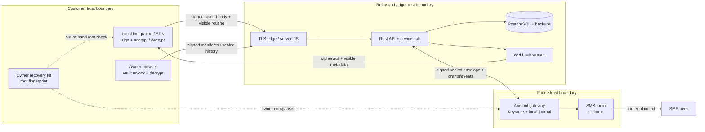

# ZT-009 sealed-content threat model and review package

**State: proposed for external review, 2026-09-23. ZT-009 is open.** The accompanying [byte profile draft 01](zt-sealed-draft-01.md) is a concrete review target, not a production protocol. No implementation or marketing claim follows from this document alone. The currently running M1 alpha route deliberately constructs synthetic plaintext on the relay and cannot satisfy a sealed-content claim.

## Security objectives and boundaries

The intended v1 claim is narrow: a correctly provisioned customer client encrypts a message body before uploading it, and the relay stores/routes ciphertext and visible metadata; an authorized phone decrypts outbound text before conventional SMS submission and encrypts inbound text before cloud upload. Passive relay/database/backup compromise should not expose bodies. A malicious relay must not forge an authorized send merely by generating an execution grant. Explicit limitations remain: the carrier, SMS recipient, phone, customer runtime and unlocked owner browser see plaintext; the server serves browser JavaScript and can deliver malicious updates; traffic, phone numbers, timing, size, status and billing remain visible. No “end-to-end encrypted SMS,” “zero knowledge,” or “we can never read messages” claim is justified.

The principal attack surfaces and required controls are:

| Boundary / adversary | Threat | Required defense and observable test |
|---|---|---|
| Compromised relay, edge or database | Read stored bodies, replace recipient keys, forge sends, replay/rollback manifests, log canaries | Client-only CEKs; owner-root-pinned signed manifest; sender signature and device-side verification; sealed-only endpoint; canary sweep of DB/backups/logs/errors/webhooks; malicious-directory tests. Active browser-code replacement remains a residual risk. |
| Stolen API bearer token | Submit requests or fetch metadata | Scope/device quotas and revocation; a separate integration signing key is required for sends. Token alone cannot sign a valid sealed envelope. |
| Lost or cloned phone | Decrypt future commands or submit events | Device-specific payload key, Keystore-backed auth key, manifest revocation, live grant/session fences and local one-attempt journal. Previously received ciphertext/plaintext and granted radio operations cannot be clawed back. |
| Malicious integration or owner client | Read bodies addressed to it, send to its scope | Owner-approved manifest scopes, least-privilege reader set, visible audit event, key revocation and rotation. The service cannot protect a client from itself. |
| Network attacker | Substitute transport, replay frames | TLS, authenticated session epochs, exact signed bytes, UUID/event dedupe and expiry. WSS is transport security, not content trust. |
| Carrier, peer or local OS compromise | Read or alter ordinary SMS or device memory | Outside sealed relay claim; disclose conventional SMS leg and endpoint exposure. |

## Draft decisions already made for review

1. Keep content authentication distinct from HTTP/API authorization and from server-issued execution grants. Outbound signed bytes bind account, message, destination, device/line, expiry, manifest, intent, ciphertext and reader set. The phone verifies the sender's approved scope before `SmsManager`.
2. Use a fresh 256-bit content key and AES-256-GCM body encryption per message, with one RFC 9180 HPKE base-mode wrap per explicitly approved reader. The P-256/HKDF-SHA256/AES-128-GCM suite is a portability candidate; use the RFC suite IDs, never an ad hoc ECDH variant. The [RFC HPKE vectors](https://www.rfc-editor.org/rfc/rfc9180.html#appendix-A.3) are the starting point.
3. Use a fixed-order versioned binary envelope with strict lengths and domain-separated signature/AAD transcripts; no JSON canonicalization or silent unknown-field acceptance. HTTP/WSS encoding may vary but the signed binary must not.
4. Maintain a signed owner key manifest with an out-of-band root pin and monotonic local high-water mark. A login reset does not regenerate content trust or recover a vault. Client keys are role-separated; the selected phone receives only its own outbound wrap, plus the owner archive and explicit readers.
5. Preserve M1's stable message ID, server claim/grant fences and no-blind-retry policy. A valid signature does not imply exactly-once radio delivery. Inbound and webhook dedupe use authenticated event identity, not ciphertext equality.

These are draft positions, not final cryptographic approval. Each remains subject to the reviewer and the unresolved items below.

## Candidate implementation compatibility check

| Runtime | Candidate for evaluation | Evidence and blocking check |
|---|---|---|
| Browser / TypeScript SDK | [`@hpke/core`](https://github.com/dajiaji/hpke-js) using Web Crypto P-256, HKDF and AES-GCM, with pinned exact dependency graph | Upstream advertises the suite and RFC vectors. Its [nonce-reuse advisory](https://github.com/dajiaji/hpke-js/security/advisories/GHSA-73g8-5h73-26h4) affected versions through 1.7.4; 1.7.5 is patched. Pin a reviewed version at or above the fix, audit its concurrent context behavior and bundle integrity, and independently test browser support. No runtime dependency is approved yet. |
| Android / Kotlin | [Tink Java HPKE](https://developers.google.com/tink/hybrid) for software interoperability and [Android Keystore](https://developer.android.com/privacy-and-security/keystore) for non-exportable hardware-backed signing/wrapping where supported | Tink lists the exact P-256 suite, but its [wire format](https://developers.google.com/tink/wire-format) can add an output prefix. Confirm raw HPKE `enc || ct` extraction, context info/AAD equivalence, key import/export and whether non-exportable Keystore ECDH can be used without custom cryptographic composition. **No hardware-backed HPKE choice is approved.** If the primitive APIs cannot meet the profile, change the profile or key-protection decision in review. |
| Rust verifier / vector reference | [`hpke` (rust-hpke)](https://github.com/rozbb/rust-hpke) with `nistp`, `aes`, `hkdfsha2` and exact lockfile pin | Upstream lists P-256, HKDF-SHA256, AES-GCM and RFC known-answer tests. Check crate version, advisories, license, selected feature graph and byte output against browser/Android. The relay should normally verify signatures and never hold a content private key; this candidate is primarily for reference vectors and optional local tooling. |

This is a **candidate shortlist**, not a finding that the three libraries already interoperate or have been independently audited together. In particular, an RFC 9180 implementation need not expose the exact transcript and non-exportable key operations this product requires. Do not write a custom HPKE implementation to bridge an API gap without a separate expert review.

## Unresolved decisions that block ZT-010 and production crypto

| ID | Decision / attack to resolve | Evidence needed to close |
|---|---|---|
| Q1 | How is the first owner root fingerprint securely transferred to a browser, SDK and phone when the relay/served JS may be malicious? TOFU from the same directory is insufficient for the strongest claim. | Concrete out-of-band enrollment/recovery ceremony, phishing and key-substitution tests, documented browser-code residual risk. |
| Q2 | What exactly does each manifest scope bitmap authorize, and how are an owner root, integration signer, device auth key and archive reader registered, expired and rotated? | Reviewed manifest schema, cross-tenant/scope negative vectors, role separation and key-loss UX. |
| Q3 | How are root rotation and lost-all-keys reset represented without an attacker-controlled server silently replacing history? | Signed rotation chain or explicit new vault generation ceremony, fork detection and recovery drill. |
| Q4 | What is the maximum accepted signed-manifest age, and how can a phone detect withheld revocations/manifest forks when offline or facing a malicious relay? | Chosen freshness window with quantified stale-key exposure, monotonic persistence tests, rollback/fork test; consider an independent transparency/witness service if the intended claim requires stronger detection. |
| Q5 | Can a maintained Android library decapsulate P-256 HPKE while the device payload private key is non-exportable in Android Keystore, and can Tink raw-mode bytes interoperate with browser/Rust? | Instrumented tests on the supported Samsung and emulator, exact `enc`, `ct`, `info`, `aad` vectors and key-storage statement. |
| Q6 | Is 64-byte P-256 `r || s` accepted on every target, and should low-`s` normalization/rejection be required? | Strict DER/raw conversion and malleability vectors across Web Crypto, Android and Rust; idempotency remains independent of signature encoding. |
| Q7 | Does the proposed body/wrap AAD and signature transcript bind all authorization-bearing metadata without circularity or replay between outbound/inbound, accounts, lines, devices or versions? | Independent cryptographic review, formal transcript table and altered-field vectors. |
| Q8 | How do inbound multipart normalization, SIM ambiguity, event sequence persistence, phone clock skew and offline journal replay work end to end? | Exact inbound event/metadata-only contract, crash/reboot tests, chosen bounds and duplicate webhook suite. |
| Q9 | What are the data limits, padding/length-leakage policy, SMS encoding rules and six-segment acceptance UX? | Cross-client Unicode/segment vectors, real-phone check, size/metadata leakage description. |
| Q10 | How are vault wrapping, recovery secret KDF/domain separation, encrypted export, archive-key retention and integration key revocation encoded? | Separate reviewed vault protocol, lost-login vs recovery vs lost-all tests, old-ciphertext disclosure. |
| Q11 | Can sealed and synthetic-alpha endpoints coexist without accidental plaintext downgrade or canary leakage through logs, traces, crash reports, backup and webhook retries? | Separate route/auth policy, parser rejection tests and seeded canary sweep across actual deployed surfaces. |
| Q12 | Which reviewer will independently review the design, chosen libraries, vectors, implementation and remediation? | Named qualified reviewer with no authorship conflict, agreed scope, dated findings and retest sign-off. |

Any change to primitive suite, byte grammar, authenticated fields or bootstrap decision increments the profile revision and regenerates vectors. A decision log should record the reviewer recommendation, accepted choice, alternatives, residual risk, owner and date for every row. A blank decision is a failed gate.

## External review brief and exit evidence

Select an independent applied cryptography reviewer experienced in RFC 9180, Android Keystore, browser Web Crypto and multi-recipient signed envelopes. Provide this package, exact source revisions/lockfiles, trust-root UX, account/enrollment and M1 grant contracts, intended claims, test vectors, synthetic canary workflow and a scoped environment. Ask for a written threat-model review before crypto implementation is treated as production design, then source review and retest after implementation. Review must include a practical attack on key-directory substitution/rollback, revocation freshness, signed routing, malformed HPKE/point/signature parsing, nonce/context concurrency, recovery and browser-code supply chain.

To mark **ZT-009 complete**, record the named reviewer, date and scope; resolve Q1–Q12 in a versioned approved profile and decision log; record remaining limitations; and obtain written review acceptance of the byte profile and threat model. To mark **M2 complete**, also require ZT-010/011/012: published cross-client known-answer and adversarial vectors, real recovery/rotation drills, strict sealed-only API behavior, no plaintext canaries in relay surfaces, independent implementation review with high-severity findings remediated and reviewer-approved retest. None of those results exists merely because this draft is merged.
